[Go to Map List of the Game](https://github.com/Ranajoy01/Map_List_Path_to_silicon_RISC_V_SoC_Tapeout_game)

---

[Go to Level List of the Map-6](https://github.com/Ranajoy01/Map_6_Path_to_silicon_RISC_V_SoC_Tapeout_game)

<div align="center">:star::star::star::star::star::star:</div> 

# Level-1: OpenROAD flow Setup

## List of Objectives

- :microscope: <b>Practical Objective-1:</b> []()
  
 <div align="center">:star::star::star::star::star::star:</div> 

## :microscope: OpenROAD flow scripts installation and setup
### :zap: Clone OpenROAD-flow-scripts repository and go to the repository directory-
```bash
$ git clone --recursive https://github.com/The-OpenROAD-Project/OpenROAD-flow-scripts --depth 1
$ cd OpenROAD-flow-scripts && ls
```
- [https://github.com/The-OpenROAD-Project/OpenROAD-flow-scripts](https://github.com/The-OpenROAD-Project/OpenROAD-flow-scripts) is the official repository which combine openroad engine with open source tools (Yosys, Klayout, OpenSTA) for RTL to GDSII flow.
- `--recursive` flag is used to clone all submodule (Else only topmodule will be cloned).
- `--depth 1` flag is used for cloning each module properly (One top module in a level at a time)

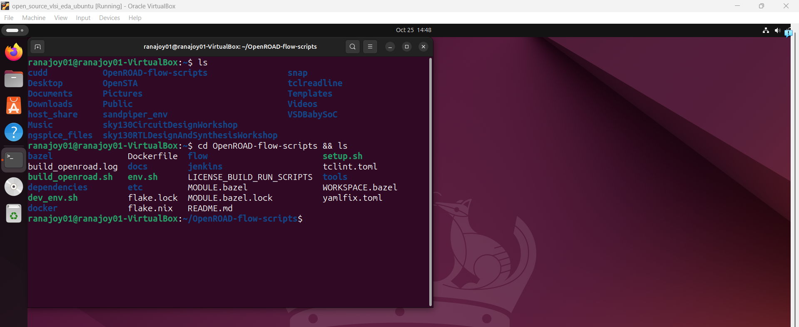

:100: OpenROAD-flow-scripts repository successfully cloned.

---

### :zap: Setup the required tools for OpenROAD-flow-scripts-
```bash
$ sudo ./setup.sh
```
- It check the dependencies if available on system or not and install if required.
- `sudo` used for overall system check for dependencies.

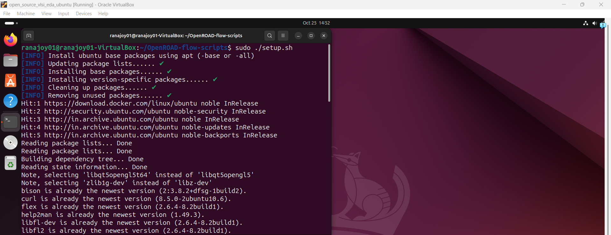  

:100: Dependency check complete and installed the required tools.

---

### :zap: Build the OpenROAD flow-
```bash
$ ./build_openroad.sh --local --threads 1
```
- `--local` flag specify that each tool is built in respective tool directory locally.
- `--threads 1` flag used to avoid error due to parallelization when multithreading used
  - Proper building of tools are not performed during multithreading.
  - RAM for VM is around 5 GB, so memory issue occurs during multithreading.
  - Race condition occurs during multithreading.
- Linking is performed during this.

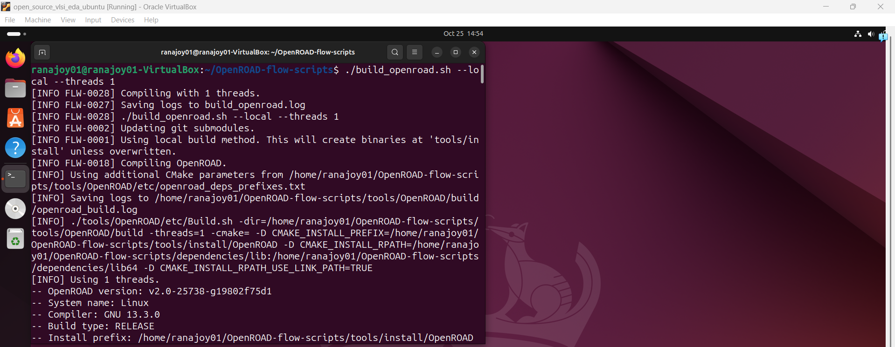

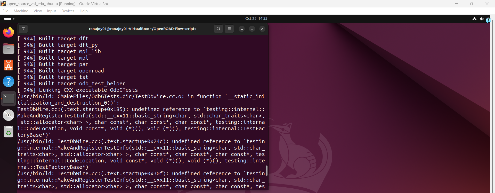

:100: OpenROAD flow script tools are built propely (binary files) but linking to OdbGtest is failed.

- For OpenROAD flow we need openroad, yosys and other tools binary file,these are built propely.
- OdbGtest is required for developers, so failure in linking to this will not cause that much problem.
      

<div align="center">:star::star::star::star::star::star:</div> 

## :microscope: Verify the setup of OpenROAD-flow-script
### :zap: `openroad` command will not work. To use `openroad` systemwide use the following command-
```bash
$ sudo ln -s ~/OpenROAD-flow-scripts/tools/OpenROAD/build/bin/openroad /usr/local/bin/openroad
```
- `ln` is used for link.
- `-s` is used for symbolic link.
- <b>Target file:</b> `~/OpenROAD-flow-scripts/tools/OpenROAD/build/bin/openroad` is the path to openroad binary.
- <b>Destination or link:</b> `/usr/local/bin/openroad`

### :zap: Verify OpenROAD installation (based on basic commands working) -
```bash
$ source ./env.sh
```
- It specify the rules and setup environment for RTL to GDSII flow.
  
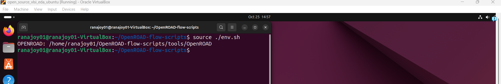

---

```bash
$ cd flow && ls
```
- Go to the flow directory.

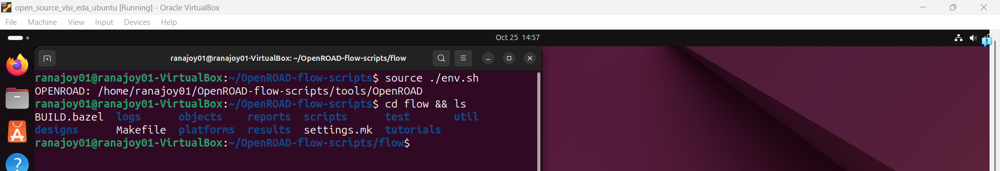

---
```bash
$ yosys -help
```
- Check if yosys command working properly (used for synthesis).
  
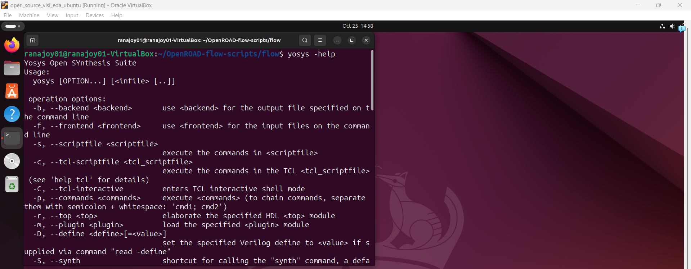
  
---
```bash
$ openroad -help
```
- Check if openroad command working propely (for RTL to GDSII flow).

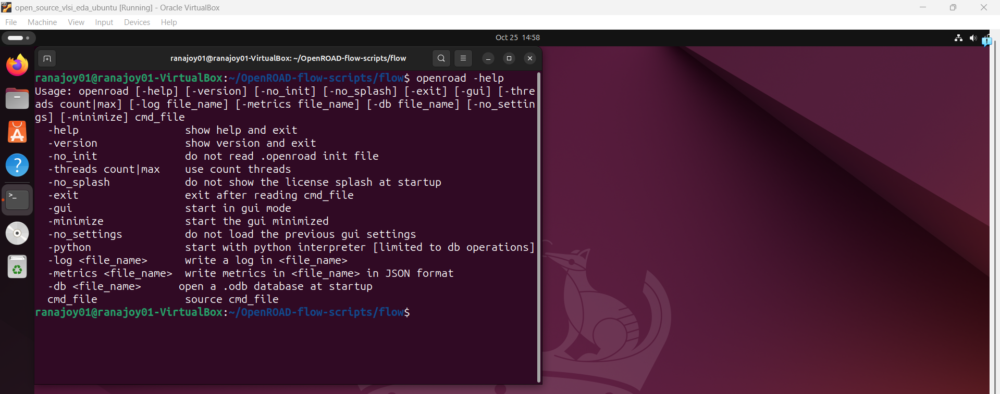

---

:100: Basic commands like yosys, openroad are working. So, OpenROAD flow script setup successful.

---
---

### :zap: Verify OpenROAD installation (based on GUI working) -
#### We will work on `flow` directory.
- In the `Makefile` in flow directory there is `-include settings.mk` which include `settings.mk` file if it is available. No such file available inititally.

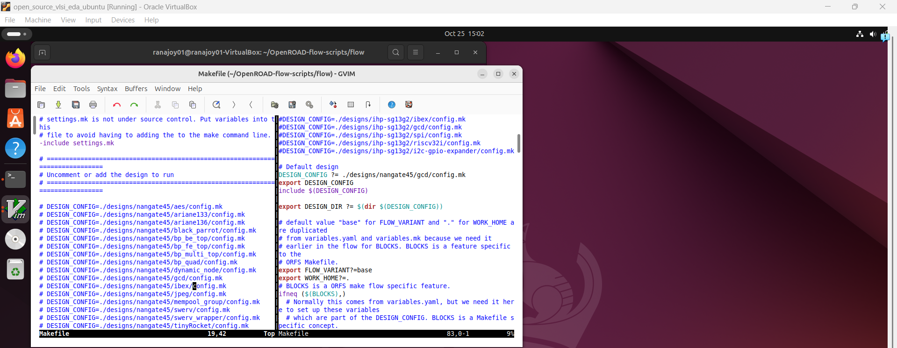
   - So, create file `settings.mk` using ```bash nano settings.mk``` with the following content-
   ```bash
    # Path to OpenROAD binary
    OPENROAD_EXE = /usr/local/bin/openroad
    
    # Path to Yosys binary
    YOSYS_EXE = /usr/local/bin/yosys
   ```
   - Here default configuration is `./designs/nangate45/gcd/config.mk.
     
---

```bash
$ make 
```
- We will not explicitly specify `YOSYS_EXE=/usr/local/bin/yosys ` and `OPENROAD_EXE=/usr/local/bin/openroad` due to `settings.mk`.

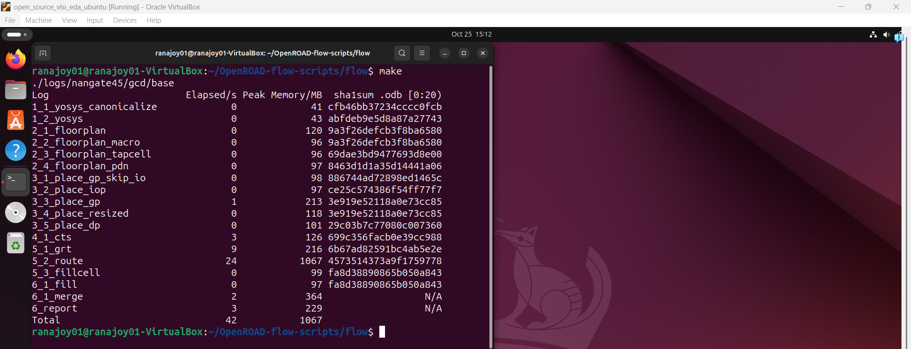

---

#### Make final layout and verify GUI working.

```bash
make gui_final 
```

- GUI for the final layout is generated using this code.

 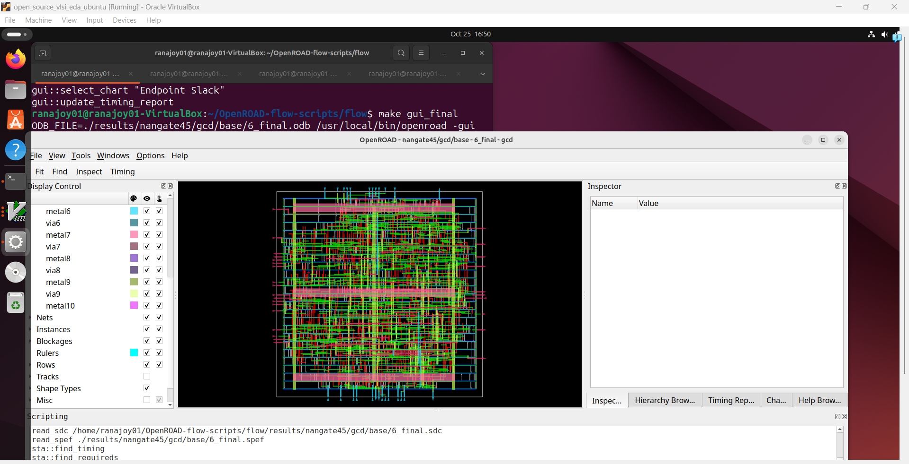 

 ---

 :100: GUI for layout is working properly. Thus the OpenROAD-flow-script is verified.


<div align="center">:star::star::star::star::star::star:</div> 

 ## :trophy: Level Status: 

- All objectives completed.
- I have setup the OpenROAD flow in Ubuntu VM.
- 🔓 Next level unlocked 🔜 [Level-2:  Floorplan and Placement of VsdBabySoC design using OpenROAD](../Level_2/readme.md).
  
<div align="center">:star::star::star::star::star::star:</div> 


