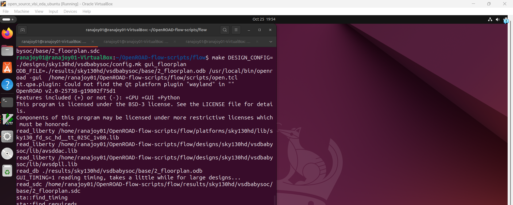
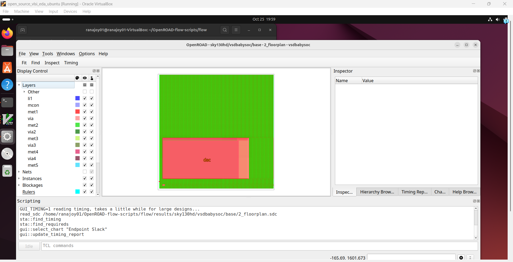
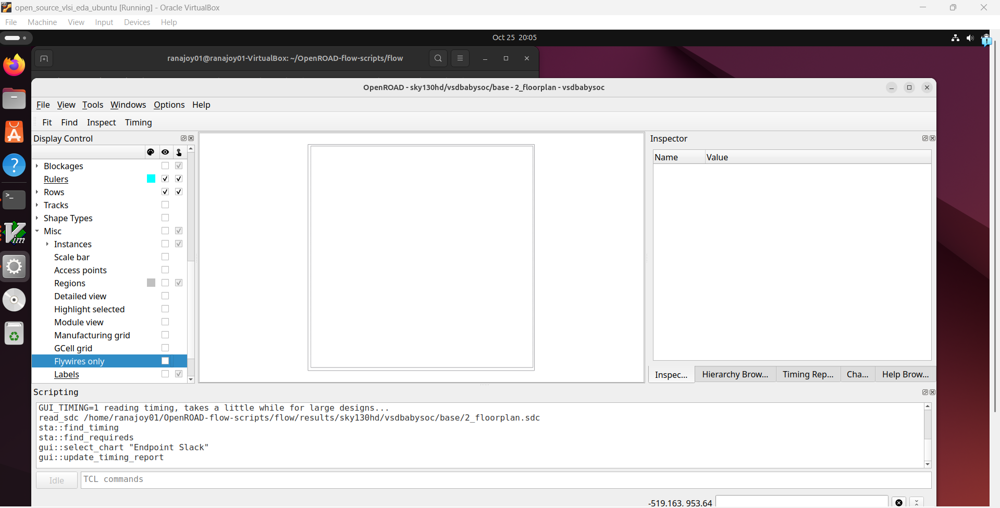
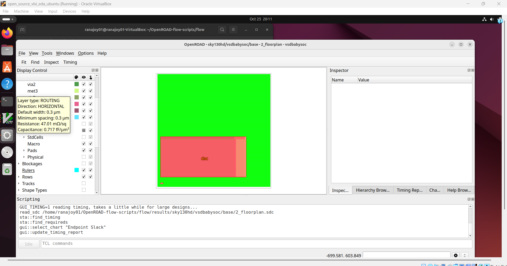
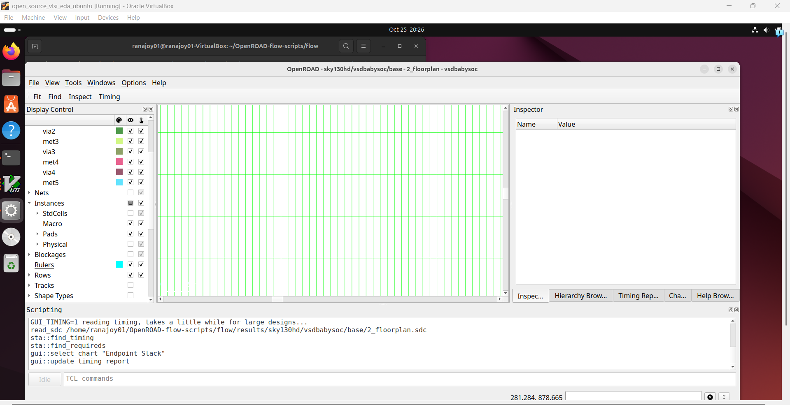
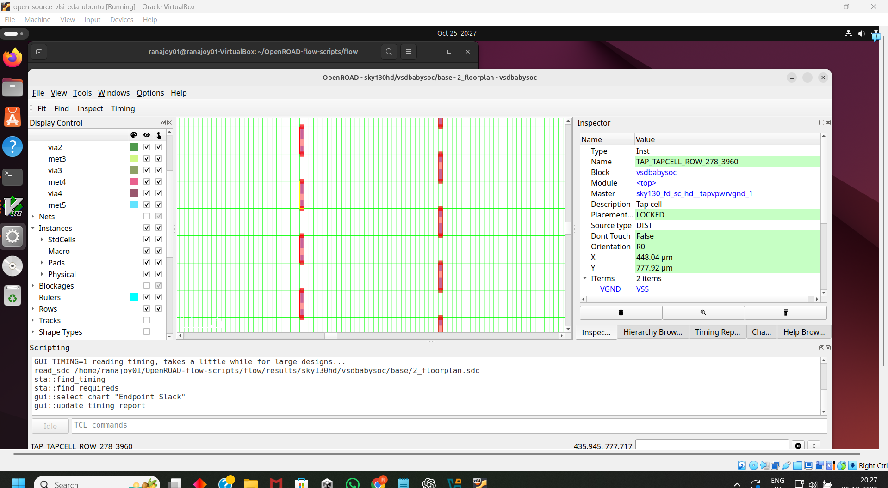
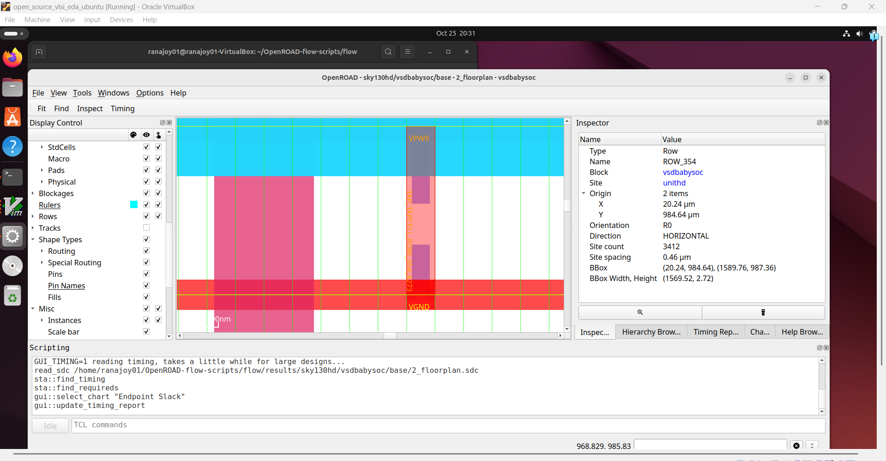
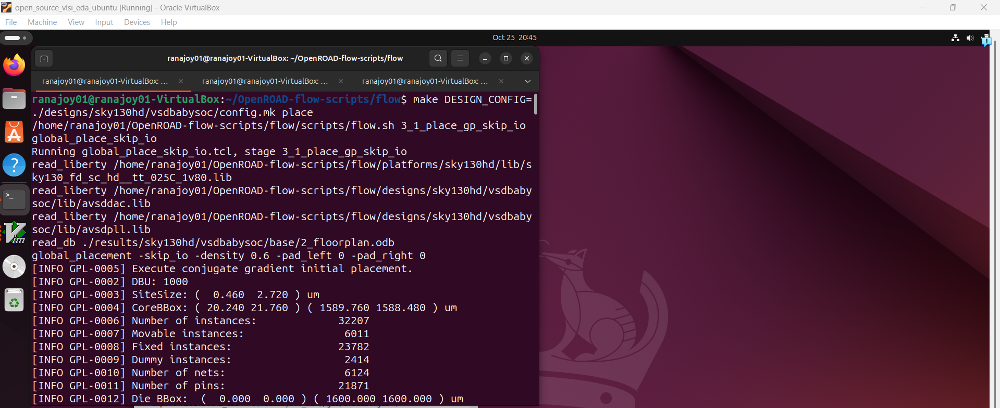

[Go to Map List of the Game](https://github.com/Ranajoy01/Map_List_Path_to_silicon_RISC_V_SoC_Tapeout_game)

---

[Go to Level List of the Map-6](https://github.com/Ranajoy01/Map_6_Path_to_silicon_RISC_V_SoC_Tapeout_game)

---

[Go to Previous Level](../Level_1/readme.md)

<div align="center">:star::star::star::star::star::star:</div> 

# Level-2: Floorplan and Placement of VsdBabySoC design using OpenROAD-flow-script

## List of Objectives

- :microscope: <b>Practical Objective-1:</b> []()
  
 <div align="center">:star::star::star::star::star::star:</div> 

## :microscope: Setup VSDBabySoC directories for physical design using OpenROAD-flow-script
### :zap: Create two vsdbabysoc directories-
- For Verilog files `~/OpenROAD-flow-scripts/flow/designs/src/vsdbabysoc`
- For config, include, macro, lib files `~/OpenROAD-flow-scripts/flow/designs/sky130hd/vsdbabysoc`

### :zap: Copy the module  directory from VSDBabySoC folder (used in previous weeks) to `~/OpenROAD-flow-scripts/flow/designs/src/vsdbabysoc`
- All verilog files (vsdbabysoc.v, rvmyth.v , clk_gate.v) are copied.

### :zap: Copy gds,  include,  layout_conf,  lef,  lib,  sdc directories from VSDBabySoC folder (used in previous weeks) to `~/OpenROAD-flow-scripts/flow/designs/sky130hd/vsdbabysoc`
- `gds` contain dac and pll gds files
- `include` contain header filess
- `layout_conf` contain macro and pin configuration files
- `lib` contain  sky130 PDK technology library files
- `sdc` contain constraints file

### :zap: Create `config.mk` file in `~/OpenROAD-flow-scripts/flow/designs/sky130hd/vsdbabysoc` directory with the following content
<details>
<summary><mark>config.mk (Expand this for configuration file content)</mark></summary>
	
```mk
  # Design and Platform Configuration
   export DESIGN_NICKNAME = vsdbabysoc
   export DESIGN_NAME = vsdbabysoc
   export PLATFORM    = sky130hd

  # Design Paths
  export vsdbabysoc_DIR = /home/ranajoy01/OpenROAD-flow-scripts/flow/designs/sky130hd/$(DESIGN_NICKNAME)

  # Explicitly list Verilog files for synthesis
   export VERILOG_FILES = /home/ranajoy01/OpenROAD-flow-scripts/flow/designs/src/vsdbabysoc/module/vsdbabysoc.v \
                         /home/ranajoy01/OpenROAD-flow-scripts/flow/designs/src/vsdbabysoc/module/rvmyth.v \
                         /home/ranajoy01/OpenROAD-flow-scripts/flow/designs/src/vsdbabysoc/module/clk_gate.v


  # Include Directory for Verilog Header Files
   export VERILOG_INCLUDE_DIRS = $(vsdbabysoc_DIR)/include

  # Constraints File
    export SDC_FILE = $(vsdbabysoc_DIR)/sdc/vsdbabysoc_synthesis.sdc

  # Additional GDS Files
    export ADDITIONAL_GDS = $(vsdbabysoc_DIR)/gds/avsddac.gds \
                            $(vsdbabysoc_DIR)/gds/avsdpll.gds

  # Additional LEF Files
   export ADDITIONAL_LEFS = $(vsdbabysoc_DIR)/lef/avsddac.lef \
                            $(vsdbabysoc_DIR)/lef/avsdpll.lef

  # Additional LIB Files
   export ADDITIONAL_LIBS = $(vsdbabysoc_DIR)/lib/avsddac.lib \
                            $(vsdbabysoc_DIR)/lib/avsdpll.lib

 # Pin Order and Macro Placement Configurations
   export FP_PIN_ORDER_CFG = $(vsdbabysoc_DIR)/layout_conf/pin_order.cfg
   export MACRO_PLACEMENT_CFG = $(vsdbabysoc_DIR)/layout_conf/macro.cfg

 # Clock Configuration
   export CLOCK_PORT = CLK
   export CLOCK_NET  = $(CLOCK_PORT)
   export CLOCK_PERIOD = 20.0

# Floorplanning Configuration
  export DIE_AREA   = 0 0 1600 1600
  export CORE_AREA  = 20 20 1590 1590

# Placement Configuration
  export PLACE_PINS_ARGS = -exclude left:0-600 -exclude left:1000-1600 -exclude right:* -exclude top:* -exclude bottom:*

# Tuning for Timing and Buffers
  export TNS_END_PERCENT     = 100
  export REMOVE_ABC_BUFFERS  = 1
  export CTS_BUF_DISTANCE    = 600
  export SKIP_GATE_CLONING   = 1

 # Magic Tool Configuration
   export MAGIC_ZEROIZE_ORIGIN = 0
   export MAGIC_EXT_USE_GDS    = 1
```

</details>

#### config.mk file is important for physical design using OpenROAD-flow-script. It contains-
- Configuration file contains the path for verilog files, constraints, header files, macro .
- Die area and core area.
- Pin and macro placement configuration.
- Clock configuration.
- Timing and buffer configuration.
- Optimization rules.
---

### :zap: Final directory tree structure-

:100: After all these steps the `~/OpenROAD-flow-scripts/flow/designs/src/vsdbabysoc` directory will have the structure like this-
```
.
└── module
    ├── a.out
    ├── avsddac.v
    ├── avsdpll.v
    ├── clk_gate.v
    ├── hello.png.pdf
    ├── post_synth.out
    ├── pre_synth_sim.vcd
    ├── pseudo_rand_gen.sv
    ├── pseudo_rand.sv
    ├── rvmyth_gen.v
    ├── rvmyth.tlv
    ├── rvmyth.v
    ├── testbench.rvmyth.post-routing.v
    ├── testbench.v
    ├── vsd_babysoc_net.v
    ├── vsdbabysoc.synth.v
    └── vsdbabysoc.v

```
:100: After all these steps the `~/OpenROAD-flow-scripts/flow/designs/sky130hd/vsdbabysoc` directory will have the structure like this-
```
.
├── config.mk -> configuration file for vsdbabysoc physical design
├── gds
│   ├── avsddac.gds
│   └── avsdpll.gds
├── include
│   ├── sandpiper_gen.vh
│   ├── sandpiper.vh
│   ├── sp_default.vh
│   └── sp_verilog.vh
├── layout_conf
│   ├── rvmyth
│   │   ├── config.tcl
│   │   └── pin_order.cfg
│   └── vsdbabysoc
│       ├── config.tcl
│       ├── macro.cfg
│       └── pin_order.cfg
├── lef
│   ├── avsddac.lef
│   └── avsdpll.lef
├── lib
│   ├── avsddac.lib -> dac macro technology library
│   ├── avsdpll.lib -> pll macro technology library
│   └── sky130_fd_sc_hd__tt_025C_1v80.lib
└── sdc
    ├── vsdbabysoc_layout.sdc
    └── vsdbabysoc_synthesis.sdc -> this sdc file is used for floorplan and placement

9 directories, 19 files

```

 <div align="center">:star::star::star::star::star::star:</div> 

## :microscope: Floorplan for VSDBabySoC design
### :zap: Perform floorplan and analyze the floorplan log

#### Inside `~/OpenROAD-flow-scripts/flow/` directory run this command-
```bash
make DESIGN_CONFIG=./designs/sky130hd/vsdbabysoc/config.mk floorplan
```
- Use the Makefile in flow directory.
- We use vsdbabysoc configuraton file instead of default configuration file.
- `floorplan` .PHONY is ued.(target file is not real but a command name used in Makefile).

#### Analysis of the floorplan.log


We get the following log in the terminal.I have annotated this log file-
<details>
<summary><mark>FLOORPLAN LOG (Expand this for the log file content)</mark></summary>
	
```
mkdir -p results/sky130hd/vsdbabysoc/base/
echo 11 > results/sky130hd/vsdbabysoc/base/clock_period.txt
-----------------------------------------------------------------------------------------------------------------------------------------------
----------------------SYNTHESIS START---------------------------
-----------------------------------------------------------------------------------------------------------------------------------------------
/home/ranajoy01/OpenROAD-flow-scripts/flow/scripts/synth.sh /home/ranajoy01/OpenROAD-flow-scripts/flow/scripts/synth_canonicalize.tcl ./logs/sky130hd/vsdbabysoc/base/1_1_yosys_canonicalize.log
Using ABC speed script.
Extracting clock period from SDC file: ./results/sky130hd/vsdbabysoc/base/clock_period.txt
Setting clock period to 11
1. Executing Liberty frontend: /home/ranajoy01/OpenROAD-flow-scripts/flow/platforms/sky130hd/lib/sky130_fd_sc_hd__tt_025C_1v80.lib
2. Executing Liberty frontend: /home/ranajoy01/OpenROAD-flow-scripts/flow/designs/sky130hd/vsdbabysoc/lib/avsddac.lib
3. Executing Liberty frontend: /home/ranajoy01/OpenROAD-flow-scripts/flow/designs/sky130hd/vsdbabysoc/lib/avsdpll.lib
4. Executing Liberty frontend: /home/ranajoy01/OpenROAD-flow-scripts/flow/platforms/sky130hd/lib/sky130_fd_sc_hd__tt_025C_1v80.lib
5. Executing Liberty frontend: /home/ranajoy01/OpenROAD-flow-scripts/flow/designs/sky130hd/vsdbabysoc/lib/avsddac.lib
6. Executing Liberty frontend: /home/ranajoy01/OpenROAD-flow-scripts/flow/designs/sky130hd/vsdbabysoc/lib/avsdpll.lib
7. Executing Verilog-2005 frontend: /home/ranajoy01/OpenROAD-flow-scripts/flow/designs/src/vsdbabysoc/module/vsdbabysoc.v
8. Executing Verilog-2005 frontend: /home/ranajoy01/OpenROAD-flow-scripts/flow/designs/src/vsdbabysoc/module/rvmyth.v
9. Executing Verilog-2005 frontend: /home/ranajoy01/OpenROAD-flow-scripts/flow/designs/src/vsdbabysoc/module/clk_gate.v
10. Executing Verilog-2005 frontend: /home/ranajoy01/OpenROAD-flow-scripts/flow/platforms/sky130hd/cells_clkgate_hd.v
11. Executing HIERARCHY pass (managing design hierarchy).
12. Executing AST frontend in derive mode using pre-parsed AST for module `\vsdbabysoc'.
12.1. Analyzing design hierarchy..
12.2. Executing AST frontend in derive mode using pre-parsed AST for module `\rvmyth'.
Warning: Replacing memory \CPU_Dmem_value_a4 with list of registers. See /home/ranajoy01/OpenROAD-flow-scripts/flow/designs/src/vsdbabysoc/module/rvmyth.v:300
Warning: Replacing memory \CPU_Xreg_value_a3 with list of registers. See /home/ranajoy01/OpenROAD-flow-scripts/flow/designs/src/vsdbabysoc/module/rvmyth.v:284
Warning: Replacing memory \CPU_Imem_instr_a1 with list of registers. See /home/ranajoy01/OpenROAD-flow-scripts/flow/designs/src/vsdbabysoc/module/rvmyth.v:273
Warning: Replacing memory \CPU_Xreg_value_a5 with list of registers. See /home/ranajoy01/OpenROAD-flow-scripts/flow/designs/src/vsdbabysoc/module/rvmyth_gen.v:693
Warning: Replacing memory \CPU_Xreg_value_a4 with list of registers. See /home/ranajoy01/OpenROAD-flow-scripts/flow/designs/src/vsdbabysoc/module/rvmyth_gen.v:692
Warning: Replacing memory \CPU_Dmem_value_a5 with list of registers. See /home/ranajoy01/OpenROAD-flow-scripts/flow/designs/src/vsdbabysoc/module/rvmyth_gen.v:683
12.3. Analyzing design hierarchy..
12.4. Executing AST frontend in derive mode using pre-parsed AST for module `\clk_gate'.
12.5. Analyzing design hierarchy..
12.6. Analyzing design hierarchy..
13. Executing OPT_CLEAN pass (remove unused cells and wires).
Warning: Ignoring module rvmyth because it contains processes (run 'proc' command first).
14. Executing RTLIL backend.
Warnings: 7 unique messages, 7 total
End of script. Logfile hash: b1f23d6ca1, CPU: user 0.29s system 0.03s, MEM: 52.14 MB peak
Yosys 0.58+35 (git sha1 89f32a415, g++ 13.3.0-6ubuntu2~24.04 -fPIC -O3)
Time spent: 63% 8x read_liberty (0 sec), 17% 1x hierarchy (0 sec), ...
Elapsed time: 0:00.45[h:]min:sec. CPU time: user 0.40 sys 0.04 (99%). Peak memory: 56756KB.
/home/ranajoy01/OpenROAD-flow-scripts/flow/scripts/synth.sh /home/ranajoy01/OpenROAD-flow-scripts/flow/scripts/synth.tcl ./logs/sky130hd/vsdbabysoc/base/1_2_yosys.log
Using ABC speed script.
Extracting clock period from SDC file: ./results/sky130hd/vsdbabysoc/base/clock_period.txt
Setting clock period to 11
1. Executing RTLIL frontend.
2. Executing HIERARCHY pass (managing design hierarchy).
2.1. Analyzing design hierarchy..
2.2. Analyzing design hierarchy..
3. Executing SYNTH pass.
3.1. Executing HIERARCHY pass (managing design hierarchy).
3.1.1. Analyzing design hierarchy..
3.1.2. Analyzing design hierarchy..
3.2. Executing PROC pass (convert processes to netlists).
3.2.1. Executing PROC_CLEAN pass (remove empty switches from decision trees).
3.2.2. Executing PROC_RMDEAD pass (remove dead branches from decision trees).
3.2.3. Executing PROC_PRUNE pass (remove redundant assignments in processes).
3.2.4. Executing PROC_INIT pass (extract init attributes).
3.2.5. Executing PROC_ARST pass (detect async resets in processes).
3.2.6. Executing PROC_ROM pass (convert switches to ROMs).
3.2.7. Executing PROC_MUX pass (convert decision trees to multiplexers).
3.2.8. Executing PROC_DLATCH pass (convert process syncs to latches).
3.2.9. Executing PROC_DFF pass (convert process syncs to FFs).
3.2.10. Executing PROC_MEMWR pass (convert process memory writes to cells).
3.2.11. Executing PROC_CLEAN pass (remove empty switches from decision trees).
3.2.12. Executing OPT_EXPR pass (perform const folding).
3.3. Executing FLATTEN pass (flatten design).
3.4. Executing OPT_EXPR pass (perform const folding).
3.5. Executing OPT_CLEAN pass (remove unused cells and wires).
3.6. Executing CHECK pass (checking for obvious problems).
3.7. Executing OPT pass (performing simple optimizations).
3.7.1. Executing OPT_EXPR pass (perform const folding).
3.7.2. Executing OPT_MERGE pass (detect identical cells).
3.7.3. Executing OPT_MUXTREE pass (detect dead branches in mux trees).
3.7.4. Executing OPT_REDUCE pass (consolidate $*mux and $reduce_* inputs).
3.7.5. Executing OPT_MERGE pass (detect identical cells).
3.7.6. Executing OPT_DFF pass (perform DFF optimizations).
3.7.7. Executing OPT_CLEAN pass (remove unused cells and wires).
3.7.8. Executing OPT_EXPR pass (perform const folding).
3.7.9. Rerunning OPT passes. (Maybe there is more to do..)
3.7.10. Executing OPT_MUXTREE pass (detect dead branches in mux trees).
3.7.11. Executing OPT_REDUCE pass (consolidate $*mux and $reduce_* inputs).
3.7.12. Executing OPT_MERGE pass (detect identical cells).
3.7.13. Executing OPT_DFF pass (perform DFF optimizations).
3.7.14. Executing OPT_CLEAN pass (remove unused cells and wires).
3.7.15. Executing OPT_EXPR pass (perform const folding).
3.7.16. Finished fast OPT passes. (There is nothing left to do.)
3.8. Executing FSM pass (extract and optimize FSM).
3.8.1. Executing FSM_DETECT pass (finding FSMs in design).
3.8.2. Executing FSM_EXTRACT pass (extracting FSM from design).
3.8.3. Executing FSM_OPT pass (simple optimizations of FSMs).
3.8.4. Executing OPT_CLEAN pass (remove unused cells and wires).
3.8.5. Executing FSM_OPT pass (simple optimizations of FSMs).
3.8.6. Executing FSM_RECODE pass (re-assigning FSM state encoding).
3.8.7. Executing FSM_INFO pass (dumping all available information on FSM cells).
3.8.8. Executing FSM_MAP pass (mapping FSMs to basic logic).
3.9. Executing OPT pass (performing simple optimizations).
3.9.1. Executing OPT_EXPR pass (perform const folding).
3.9.2. Executing OPT_MERGE pass (detect identical cells).
3.9.3. Executing OPT_MUXTREE pass (detect dead branches in mux trees).
3.9.4. Executing OPT_REDUCE pass (consolidate $*mux and $reduce_* inputs).
3.9.5. Executing OPT_MERGE pass (detect identical cells).
3.9.6. Executing OPT_DFF pass (perform DFF optimizations).
3.9.7. Executing OPT_CLEAN pass (remove unused cells and wires).
3.9.8. Executing OPT_EXPR pass (perform const folding).
3.9.9. Rerunning OPT passes. (Maybe there is more to do..)
3.9.10. Executing OPT_MUXTREE pass (detect dead branches in mux trees).
3.9.11. Executing OPT_REDUCE pass (consolidate $*mux and $reduce_* inputs).
3.9.12. Executing OPT_MERGE pass (detect identical cells).
3.9.13. Executing OPT_DFF pass (perform DFF optimizations).
3.9.14. Executing OPT_CLEAN pass (remove unused cells and wires).
3.9.15. Executing OPT_EXPR pass (perform const folding).
3.9.16. Rerunning OPT passes. (Maybe there is more to do..)
3.9.17. Executing OPT_MUXTREE pass (detect dead branches in mux trees).
3.9.18. Executing OPT_REDUCE pass (consolidate $*mux and $reduce_* inputs).
3.9.19. Executing OPT_MERGE pass (detect identical cells).
3.9.20. Executing OPT_DFF pass (perform DFF optimizations).
3.9.21. Executing OPT_CLEAN pass (remove unused cells and wires).
3.9.22. Executing OPT_EXPR pass (perform const folding).
3.9.23. Finished fast OPT passes. (There is nothing left to do.)
3.10. Executing WREDUCE pass (reducing word size of cells).
3.11. Executing PEEPOPT pass (run peephole optimizers).
3.12. Executing OPT_CLEAN pass (remove unused cells and wires).
3.13. Executing ALUMACC pass (create $alu and $macc cells).
3.14. Executing SHARE pass (SAT-based resource sharing).
3.15. Executing OPT pass (performing simple optimizations).
3.15.1. Executing OPT_EXPR pass (perform const folding).
3.15.2. Executing OPT_MERGE pass (detect identical cells).
3.15.3. Executing OPT_MUXTREE pass (detect dead branches in mux trees).
3.15.4. Executing OPT_REDUCE pass (consolidate $*mux and $reduce_* inputs).
3.15.5. Executing OPT_MERGE pass (detect identical cells).
3.15.6. Executing OPT_DFF pass (perform DFF optimizations).
3.15.7. Executing OPT_CLEAN pass (remove unused cells and wires).
3.15.8. Executing OPT_EXPR pass (perform const folding).
3.15.9. Rerunning OPT passes. (Maybe there is more to do..)
3.15.10. Executing OPT_MUXTREE pass (detect dead branches in mux trees).
3.15.11. Executing OPT_REDUCE pass (consolidate $*mux and $reduce_* inputs).
3.15.12. Executing OPT_MERGE pass (detect identical cells).
3.15.13. Executing OPT_DFF pass (perform DFF optimizations).
3.15.14. Executing OPT_CLEAN pass (remove unused cells and wires).
3.15.15. Executing OPT_EXPR pass (perform const folding).
3.15.16. Finished fast OPT passes. (There is nothing left to do.)
3.16. Executing MEMORY pass.
3.16.1. Executing OPT_MEM pass (optimize memories).
3.16.2. Executing OPT_MEM_PRIORITY pass (removing unnecessary memory write priority relations).
3.16.3. Executing OPT_MEM_FEEDBACK pass (finding memory read-to-write feedback paths).
3.16.4. Executing MEMORY_BMUX2ROM pass (converting muxes to ROMs).
3.16.5. Executing MEMORY_DFF pass (merging $dff cells to $memrd).
3.16.6. Executing OPT_CLEAN pass (remove unused cells and wires).
3.16.7. Executing MEMORY_SHARE pass (consolidating $memrd/$memwr cells).
3.16.8. Executing OPT_MEM_WIDEN pass (optimize memories where all ports are wide).
3.16.9. Executing OPT_CLEAN pass (remove unused cells and wires).
3.16.10. Executing MEMORY_COLLECT pass (generating $mem cells).
3.17. Executing OPT_CLEAN pass (remove unused cells and wires).
4. Executing SYNTH pass.
4.1. Executing OPT pass (performing simple optimizations).
4.1.1. Executing OPT_EXPR pass (perform const folding).
4.1.2. Executing OPT_MERGE pass (detect identical cells).
4.1.3. Executing OPT_DFF pass (perform DFF optimizations).
4.1.4. Executing OPT_CLEAN pass (remove unused cells and wires).
4.1.5. Rerunning OPT passes. (Removed registers in this run.)
4.1.6. Executing OPT_EXPR pass (perform const folding).
4.1.7. Executing OPT_MERGE pass (detect identical cells).
4.1.8. Executing OPT_DFF pass (perform DFF optimizations).
4.1.9. Executing OPT_CLEAN pass (remove unused cells and wires).
4.1.10. Finished fast OPT passes.
4.2. Executing MEMORY_MAP pass (converting memories to logic and flip-flops).
4.3. Executing OPT pass (performing simple optimizations).
4.3.1. Executing OPT_EXPR pass (perform const folding).
4.3.2. Executing OPT_MERGE pass (detect identical cells).
4.3.3. Executing OPT_MUXTREE pass (detect dead branches in mux trees).
4.3.4. Executing OPT_REDUCE pass (consolidate $*mux and $reduce_* inputs).
4.3.5. Executing OPT_MERGE pass (detect identical cells).
4.3.6. Executing OPT_SHARE pass.
4.3.7. Executing OPT_DFF pass (perform DFF optimizations).
4.3.8. Executing OPT_CLEAN pass (remove unused cells and wires).
4.3.9. Executing OPT_EXPR pass (perform const folding).
4.3.10. Rerunning OPT passes. (Maybe there is more to do..)
4.3.11. Executing OPT_MUXTREE pass (detect dead branches in mux trees).
4.3.12. Executing OPT_REDUCE pass (consolidate $*mux and $reduce_* inputs).
4.3.13. Executing OPT_MERGE pass (detect identical cells).
4.3.14. Executing OPT_SHARE pass.
4.3.15. Executing OPT_DFF pass (perform DFF optimizations).
4.3.16. Executing OPT_CLEAN pass (remove unused cells and wires).
4.3.17. Executing OPT_EXPR pass (perform const folding).
4.3.18. Rerunning OPT passes. (Maybe there is more to do..)
4.3.19. Executing OPT_MUXTREE pass (detect dead branches in mux trees).
4.3.20. Executing OPT_REDUCE pass (consolidate $*mux and $reduce_* inputs).
4.3.21. Executing OPT_MERGE pass (detect identical cells).
4.3.22. Executing OPT_SHARE pass.
4.3.23. Executing OPT_DFF pass (perform DFF optimizations).
4.3.24. Executing OPT_CLEAN pass (remove unused cells and wires).
4.3.25. Executing OPT_EXPR pass (perform const folding).
4.3.26. Rerunning OPT passes. (Maybe there is more to do..)
4.3.27. Executing OPT_MUXTREE pass (detect dead branches in mux trees).
4.3.28. Executing OPT_REDUCE pass (consolidate $*mux and $reduce_* inputs).
4.3.29. Executing OPT_MERGE pass (detect identical cells).
4.3.30. Executing OPT_SHARE pass.
4.3.31. Executing OPT_DFF pass (perform DFF optimizations).
4.3.32. Executing OPT_CLEAN pass (remove unused cells and wires).
4.3.33. Executing OPT_EXPR pass (perform const folding).
4.3.34. Rerunning OPT passes. (Maybe there is more to do..)
4.3.35. Executing OPT_MUXTREE pass (detect dead branches in mux trees).
4.3.36. Executing OPT_REDUCE pass (consolidate $*mux and $reduce_* inputs).
4.3.37. Executing OPT_MERGE pass (detect identical cells).
4.3.38. Executing OPT_SHARE pass.
4.3.39. Executing OPT_DFF pass (perform DFF optimizations).
4.3.40. Executing OPT_CLEAN pass (remove unused cells and wires).
4.3.41. Executing OPT_EXPR pass (perform const folding).
4.3.42. Rerunning OPT passes. (Maybe there is more to do..)
4.3.43. Executing OPT_MUXTREE pass (detect dead branches in mux trees).
4.3.44. Executing OPT_REDUCE pass (consolidate $*mux and $reduce_* inputs).
4.3.45. Executing OPT_MERGE pass (detect identical cells).
4.3.46. Executing OPT_SHARE pass.
4.3.47. Executing OPT_DFF pass (perform DFF optimizations).
4.3.48. Executing OPT_CLEAN pass (remove unused cells and wires).
4.3.49. Executing OPT_EXPR pass (perform const folding).
4.3.50. Rerunning OPT passes. (Maybe there is more to do..)
4.3.51. Executing OPT_MUXTREE pass (detect dead branches in mux trees).
4.3.52. Executing OPT_REDUCE pass (consolidate $*mux and $reduce_* inputs).
4.3.53. Executing OPT_MERGE pass (detect identical cells).
4.3.54. Executing OPT_SHARE pass.
4.3.55. Executing OPT_DFF pass (perform DFF optimizations).
4.3.56. Executing OPT_CLEAN pass (remove unused cells and wires).
4.3.57. Executing OPT_EXPR pass (perform const folding).
4.3.58. Finished fast OPT passes. (There is nothing left to do.)
4.4. Executing TECHMAP pass (map to technology primitives).
4.4.1. Executing Verilog-2005 frontend: /usr/local/bin/../share/yosys/techmap.v
4.4.2. Executing Verilog-2005 frontend: /home/ranajoy01/OpenROAD-flow-scripts/flow/platforms/common/lcu_kogge_stone.v
4.4.3. Continuing TECHMAP pass.
4.5. Executing OPT pass (performing simple optimizations).
4.5.1. Executing OPT_EXPR pass (perform const folding).
4.5.2. Executing OPT_MERGE pass (detect identical cells).
4.5.3. Executing OPT_DFF pass (perform DFF optimizations).
4.5.4. Executing OPT_CLEAN pass (remove unused cells and wires).
4.5.5. Rerunning OPT passes. (Removed registers in this run.)
4.5.6. Executing OPT_EXPR pass (perform const folding).
4.5.7. Executing OPT_MERGE pass (detect identical cells).
4.5.8. Executing OPT_DFF pass (perform DFF optimizations).
4.5.9. Executing OPT_CLEAN pass (remove unused cells and wires).
4.5.10. Rerunning OPT passes. (Removed registers in this run.)
4.5.11. Executing OPT_EXPR pass (perform const folding).
4.5.12. Executing OPT_MERGE pass (detect identical cells).
4.5.13. Executing OPT_DFF pass (perform DFF optimizations).
4.5.14. Executing OPT_CLEAN pass (remove unused cells and wires).
4.5.15. Finished fast OPT passes.
4.6. Executing ABC pass (technology mapping using ABC).
4.6.1. Extracting gate netlist of module `\vsdbabysoc' to `<abc-temp-dir>/input.blif'..
4.7. Executing OPT pass (performing simple optimizations).
4.7.1. Executing OPT_EXPR pass (perform const folding).
4.7.2. Executing OPT_MERGE pass (detect identical cells).
4.7.3. Executing OPT_DFF pass (perform DFF optimizations).
4.7.4. Executing OPT_CLEAN pass (remove unused cells and wires).
4.7.5. Finished fast OPT passes.
4.8. Executing HIERARCHY pass (managing design hierarchy).
4.8.1. Analyzing design hierarchy..
4.8.2. Analyzing design hierarchy..
4.9. Printing statistics.
4.10. Executing CHECK pass (checking for obvious problems).
5. Executing OPT pass (performing simple optimizations).
5.1. Executing OPT_EXPR pass (perform const folding).
5.2. Executing OPT_MERGE pass (detect identical cells).
5.3. Executing OPT_MUXTREE pass (detect dead branches in mux trees).
5.4. Executing OPT_REDUCE pass (consolidate $*mux and $reduce_* inputs).
5.5. Executing OPT_MERGE pass (detect identical cells).
5.6. Executing OPT_DFF pass (perform DFF optimizations).
5.7. Executing OPT_CLEAN pass (remove unused cells and wires).
5.8. Executing OPT_EXPR pass (perform const folding).
5.9. Rerunning OPT passes. (Maybe there is more to do..)
5.10. Executing OPT_MUXTREE pass (detect dead branches in mux trees).
5.11. Executing OPT_REDUCE pass (consolidate $*mux and $reduce_* inputs).
5.12. Executing OPT_MERGE pass (detect identical cells).
5.13. Executing OPT_DFF pass (perform DFF optimizations).
5.14. Executing OPT_CLEAN pass (remove unused cells and wires).
5.15. Executing OPT_EXPR pass (perform const folding).
5.16. Finished fast OPT passes. (There is nothing left to do.)
6. Executing EXTRACT_FA pass (find and extract full/half adders).
7. Executing TECHMAP pass (map to technology primitives).
7.1. Executing Verilog-2005 frontend: /home/ranajoy01/OpenROAD-flow-scripts/flow/platforms/sky130hd/cells_adders_hd.v
7.2. Continuing TECHMAP pass.
8. Executing TECHMAP pass (map to technology primitives).
8.1. Executing Verilog-2005 frontend: /usr/local/bin/../share/yosys/techmap.v
8.2. Continuing TECHMAP pass.
9. Executing OPT pass (performing simple optimizations).
9.1. Executing OPT_EXPR pass (perform const folding).
9.2. Executing OPT_MERGE pass (detect identical cells).
9.3. Executing OPT_DFF pass (perform DFF optimizations).
9.4. Executing OPT_CLEAN pass (remove unused cells and wires).
9.5. Finished fast OPT passes.
10. Executing TECHMAP pass (map to technology primitives).
10.1. Executing Verilog-2005 frontend: /home/ranajoy01/OpenROAD-flow-scripts/flow/platforms/sky130hd/cells_latch_hd.v
10.2. Continuing TECHMAP pass.
11. Executing DFFLIBMAP pass (mapping DFF cells to sequential cells from liberty file).
11.1. Executing DFFLEGALIZE pass (convert FFs to types supported by the target).
12. Executing OPT pass (performing simple optimizations).
12.1. Executing OPT_EXPR pass (perform const folding).
12.2. Executing OPT_MERGE pass (detect identical cells).
12.3. Executing OPT_MUXTREE pass (detect dead branches in mux trees).
12.4. Executing OPT_REDUCE pass (consolidate $*mux and $reduce_* inputs).
12.5. Executing OPT_MERGE pass (detect identical cells).
12.6. Executing OPT_DFF pass (perform DFF optimizations).
12.7. Executing OPT_CLEAN pass (remove unused cells and wires).
12.8. Executing OPT_EXPR pass (perform const folding).
12.9. Finished fast OPT passes. (There is nothing left to do.)
13. Executing SETUNDEF pass (replace undef values with defined constants).
abc -script /home/ranajoy01/OpenROAD-flow-scripts/flow/scripts/abc_speed.script -liberty /home/ranajoy01/OpenROAD-flow-scripts/flow/platforms/sky130hd/lib/sky130_fd_sc_hd__tt_025C_1v80.lib -liberty /home/ranajoy01/OpenROAD-flow-scripts/flow/designs/sky130hd/vsdbabysoc/lib/avsddac.lib -liberty /home/ranajoy01/OpenROAD-flow-scripts/flow/designs/sky130hd/vsdbabysoc/lib/avsdpll.lib -dont_use sky130_fd_sc_hd__probe_p_8 -dont_use sky130_fd_sc_hd__probec_p_8 -dont_use sky130_fd_sc_hd__lpflow_bleeder_1 -dont_use sky130_fd_sc_hd__lpflow_clkbufkapwr_1 -dont_use sky130_fd_sc_hd__lpflow_clkbufkapwr_16 -dont_use sky130_fd_sc_hd__lpflow_clkbufkapwr_2 -dont_use sky130_fd_sc_hd__lpflow_clkbufkapwr_4 -dont_use sky130_fd_sc_hd__lpflow_clkbufkapwr_8 -dont_use sky130_fd_sc_hd__lpflow_clkinvkapwr_1 -dont_use sky130_fd_sc_hd__lpflow_clkinvkapwr_16 -dont_use sky130_fd_sc_hd__lpflow_clkinvkapwr_2 -dont_use sky130_fd_sc_hd__lpflow_clkinvkapwr_4 -dont_use sky130_fd_sc_hd__lpflow_clkinvkapwr_8 -dont_use sky130_fd_sc_hd__lpflow_decapkapwr_12 -dont_use sky130_fd_sc_hd__lpflow_decapkapwr_3 -dont_use sky130_fd_sc_hd__lpflow_decapkapwr_4 -dont_use sky130_fd_sc_hd__lpflow_decapkapwr_6 -dont_use sky130_fd_sc_hd__lpflow_decapkapwr_8 -dont_use sky130_fd_sc_hd__lpflow_inputiso0n_1 -dont_use sky130_fd_sc_hd__lpflow_inputiso0p_1 -dont_use sky130_fd_sc_hd__lpflow_inputiso1n_1 -dont_use sky130_fd_sc_hd__lpflow_inputiso1p_1 -dont_use sky130_fd_sc_hd__lpflow_inputisolatch_1 -dont_use sky130_fd_sc_hd__lpflow_isobufsrc_1 -dont_use sky130_fd_sc_hd__lpflow_isobufsrc_16 -dont_use sky130_fd_sc_hd__lpflow_isobufsrc_2 -dont_use sky130_fd_sc_hd__lpflow_isobufsrc_4 -dont_use sky130_fd_sc_hd__lpflow_isobufsrc_8 -dont_use sky130_fd_sc_hd__lpflow_isobufsrckapwr_16 -dont_use sky130_fd_sc_hd__lpflow_lsbuf_lh_hl_isowell_tap_1 -dont_use sky130_fd_sc_hd__lpflow_lsbuf_lh_hl_isowell_tap_2 -dont_use sky130_fd_sc_hd__lpflow_lsbuf_lh_hl_isowell_tap_4 -dont_use sky130_fd_sc_hd__lpflow_lsbuf_lh_isowell_4 -dont_use sky130_fd_sc_hd__lpflow_lsbuf_lh_isowell_tap_1 -dont_use sky130_fd_sc_hd__lpflow_lsbuf_lh_isowell_tap_2 -dont_use sky130_fd_sc_hd__lpflow_lsbuf_lh_isowell_tap_4 -constr ./objects/sky130hd/vsdbabysoc/base/abc.constr -D 11
14. Executing ABC pass (technology mapping using ABC).
14.1. Extracting gate netlist of module `\vsdbabysoc' to `<abc-temp-dir>/input.blif'..
14.1.1. Executed ABC.
14.1.2. Re-integrating ABC results.
Took 6 seconds: abc -script /home/ranajoy01/OpenROAD-flow-scripts/flow/scripts/abc_speed.script -liberty /home/ranajoy01/OpenROAD-flow-scripts/flow/platforms/sky130hd/lib/sky130_fd_sc_hd__tt_025C_1v80.lib -liberty /home/ranajoy01/OpenROAD-flow-scripts/flow/designs/sky130hd/vsdbabysoc/lib/avsddac.lib -liberty /home/ranajoy01/OpenROAD-flow-scripts/flow/designs/sky130hd/vsdbabysoc/lib/avsdpll.lib -dont_use sky130_fd_sc_hd__probe_p_8 -dont_use sky130_fd_sc_hd__probec_p_8 -dont_use sky130_fd_sc_hd__lpflow_bleeder_1 -dont_use sky130_fd_sc_hd__lpflow_clkbufkapwr_1 -dont_use sky130_fd_sc_hd__lpflow_clkbufkapwr_16 -dont_use sky130_fd_sc_hd__lpflow_clkbufkapwr_2 -dont_use sky130_fd_sc_hd__lpflow_clkbufkapwr_4 -dont_use sky130_fd_sc_hd__lpflow_clkbufkapwr_8 -dont_use sky130_fd_sc_hd__lpflow_clkinvkapwr_1 -dont_use sky130_fd_sc_hd__lpflow_clkinvkapwr_16 -dont_use sky130_fd_sc_hd__lpflow_clkinvkapwr_2 -dont_use sky130_fd_sc_hd__lpflow_clkinvkapwr_4 -dont_use sky130_fd_sc_hd__lpflow_clkinvkapwr_8 -dont_use sky130_fd_sc_hd__lpflow_decapkapwr_12 -dont_use sky130_fd_sc_hd__lpflow_decapkapwr_3 -dont_use sky130_fd_sc_hd__lpflow_decapkapwr_4 -dont_use sky130_fd_sc_hd__lpflow_decapkapwr_6 -dont_use sky130_fd_sc_hd__lpflow_decapkapwr_8 -dont_use sky130_fd_sc_hd__lpflow_inputiso0n_1 -dont_use sky130_fd_sc_hd__lpflow_inputiso0p_1 -dont_use sky130_fd_sc_hd__lpflow_inputiso1n_1 -dont_use sky130_fd_sc_hd__lpflow_inputiso1p_1 -dont_use sky130_fd_sc_hd__lpflow_inputisolatch_1 -dont_use sky130_fd_sc_hd__lpflow_isobufsrc_1 -dont_use sky130_fd_sc_hd__lpflow_isobufsrc_16 -dont_use sky130_fd_sc_hd__lpflow_isobufsrc_2 -dont_use sky130_fd_sc_hd__lpflow_isobufsrc_4 -dont_use sky130_fd_sc_hd__lpflow_isobufsrc_8 -dont_use sky130_fd_sc_hd__lpflow_isobufsrckapwr_16 -dont_use sky130_fd_sc_hd__lpflow_lsbuf_lh_hl_isowell_tap_1 -dont_use sky130_fd_sc_hd__lpflow_lsbuf_lh_hl_isowell_tap_2 -dont_use sky130_fd_sc_hd__lpflow_lsbuf_lh_hl_isowell_tap_4 -dont_use sky130_fd_sc_hd__lpflow_lsbuf_lh_isowell_4 -dont_use sky130_fd_sc_hd__lpflow_lsbuf_lh_isowell_tap_1 -dont_use sky130_fd_sc_hd__lpflow_lsbuf_lh_isowell_tap_2 -dont_use sky130_fd_sc_hd__lpflow_lsbuf_lh_isowell_tap_4 -constr ./objects/sky130hd/vsdbabysoc/base/abc.constr -D 11
15. Executing SPLITNETS pass (splitting up multi-bit signals).
16. Executing OPT_CLEAN pass (remove unused cells and wires).
17. Executing HILOMAP pass (mapping to constant drivers).
18. Executing INSBUF pass (insert buffer cells for connected wires).
19. Executing CHECK pass (checking for obvious problems).
20. Printing statistics.
21. Executing CHECK pass (checking for obvious problems).
22. Executing Verilog backend.
22.1. Executing BMUXMAP pass.
22.2. Executing DEMUXMAP pass.
exec cp /home/ranajoy01/OpenROAD-flow-scripts/flow/designs/sky130hd/vsdbabysoc/sdc/vsdbabysoc_synthesis.sdc ./results/sky130hd/vsdbabysoc/base/1_synth.sdc
End of script. Logfile hash: 8ec147a303, CPU: user 5.09s system 0.07s, MEM: 72.62 MB peak
Yosys 0.58+35 (git sha1 89f32a415, g++ 13.3.0-6ubuntu2~24.04 -fPIC -O3)
Time spent: 56% 2x abc (6 sec), 10% 34x opt_clean (1 sec), ...
Elapsed time: 0:11.45[h:]min:sec. CPU time: user 11.28 sys 0.17 (100%). Peak memory: 75812KB.
mkdir -p ./results/sky130hd/vsdbabysoc/base ./logs/sky130hd/vsdbabysoc/base ./reports/sky130hd/vsdbabysoc/base
cp ./results/sky130hd/vsdbabysoc/base/1_2_yosys.v ./results/sky130hd/vsdbabysoc/base/1_synth.v
-----------------------------------------------------------------------------------------------------------------------------------------------
----------------------SYNTHESIS END---------------------------
-----------------------------------------------------------------------------------------------------------------------------------------------
-----------------------------------------------------------------------------------------------------------------------------------------------
---------------------FLOORPLAN START---------------------------
-----------------------------------------------------------------------------------------------------------------------------------------------
/home/ranajoy01/OpenROAD-flow-scripts/flow/scripts/flow.sh 2_1_floorplan floorplan
Running floorplan.tcl, stage 2_1_floorplan
read_liberty /home/ranajoy01/OpenROAD-flow-scripts/flow/platforms/sky130hd/lib/sky130_fd_sc_hd__tt_025C_1v80.lib
read_liberty /home/ranajoy01/OpenROAD-flow-scripts/flow/designs/sky130hd/vsdbabysoc/lib/avsddac.lib
read_liberty /home/ranajoy01/OpenROAD-flow-scripts/flow/designs/sky130hd/vsdbabysoc/lib/avsdpll.lib
[INFO ODB-0227] LEF file: /home/ranajoy01/OpenROAD-flow-scripts/flow/platforms/sky130hd/lef/sky130_fd_sc_hd.tlef, created 13 layers, 25 vias
[INFO ODB-0227] LEF file: /home/ranajoy01/OpenROAD-flow-scripts/flow/platforms/sky130hd/lef/sky130_fd_sc_hd_merged.lef, created 441 library cells
[WARNING ODB-0220] WARNING (LEFPARS-2008): NOWIREEXTENSIONATPIN statement is obsolete in version 5.6 or later.
The NOWIREEXTENSIONATPIN statement will be ignored. See file /home/ranajoy01/OpenROAD-flow-scripts/flow/designs/sky130hd/vsdbabysoc/lef/avsddac.lef at line 2.

[INFO ODB-0227] LEF file: /home/ranajoy01/OpenROAD-flow-scripts/flow/designs/sky130hd/vsdbabysoc/lef/avsddac.lef, created 1 library cells
[WARNING ODB-0220] WARNING (LEFPARS-2008): NOWIREEXTENSIONATPIN statement is obsolete in version 5.6 or later.
The NOWIREEXTENSIONATPIN statement will be ignored. See file /home/ranajoy01/OpenROAD-flow-scripts/flow/designs/sky130hd/vsdbabysoc/lef/avsdpll.lef at line 2.

[WARNING ODB-0186] macro avsdpll references unknown site unithddb1
[INFO ODB-0227] LEF file: /home/ranajoy01/OpenROAD-flow-scripts/flow/designs/sky130hd/vsdbabysoc/lef/avsdpll.lef, created 1 library cells
link_design vsdbabysoc
Master sky130_ef_sc_hd__decap_12 is loaded but not used in the design

==========================================================================
Floorplan check_setup
--------------------------------------------------------------------------
Warning: There are 7 input ports missing set_input_delay.
Warning: There is 1 output port missing set_output_delay.
Warning: There are 2 unconstrained endpoints.
-----------------------------------------------------------------------------------------------------------------------------------------------
--------------Instances in verilog design---------------------
-----------------------------------------------------------------------------------------------------------------------------------------------
number instances in verilog is 6605
[WARNING IFP-0028] Core area lower left (20.000, 20.000) snapped to (20.240, 21.760).
---------------------------------------------------------------------------------------------------------------------------------------------
-----------No of rows and site----------------------------
----------------------------------------------------------------------------------------------------------------------------------------------
[INFO IFP-0001] Added 576 rows of 3412 site unithd.
source /home/ranajoy01/OpenROAD-flow-scripts/flow/platforms/sky130hd/make_tracks.tcl
source /home/ranajoy01/OpenROAD-flow-scripts/flow/platforms/sky130hd/fastroute.tcl
Repair tie lo fanout...
[INFO RSZ-0042] Inserted 4 tie sky130_fd_sc_hd__conb_1 instances.
Repair tie hi fanout...
[INFO RSZ-0026] Removed 595 buffers.
Default units for flow
 time 1ns
 capacitance 1pF
 resistance 1kohm
 voltage 1v
 current 1mA
 power 1nW
 distance 1um
Report metrics stage 2, floorplan final...

==========================================================================
floorplan final report_design_area
--------------------------------------------------------------------------
-----------------------------------------------------------------------------------------------------------------------------------------------
--------------Design area utilization-------------
-----------------------------------------------------------------------------------------------------------------------------------------------
Design area 722267 um^2 29% utilization.
Elapsed time: 0:03.58[h:]min:sec. CPU time: user 3.50 sys 0.70 (117%). Peak memory: 141124KB.
Log                        Elapsed/s Peak Memory/MB  sha1sum .odb [0:20)
2_1_floorplan                      3            137 a8e0dc991bf12e8968c5
/home/ranajoy01/OpenROAD-flow-scripts/flow/scripts/flow.sh 2_2_floorplan_macro macro_place
Running macro_place.tcl, stage 2_2_floorplan_macro
read_liberty /home/ranajoy01/OpenROAD-flow-scripts/flow/platforms/sky130hd/lib/sky130_fd_sc_hd__tt_025C_1v80.lib
read_liberty /home/ranajoy01/OpenROAD-flow-scripts/flow/designs/sky130hd/vsdbabysoc/lib/avsddac.lib
read_liberty /home/ranajoy01/OpenROAD-flow-scripts/flow/designs/sky130hd/vsdbabysoc/lib/avsdpll.lib
read_db ./results/sky130hd/vsdbabysoc/base/2_1_floorplan.odb
rtl_macro_placer -max_num_level 2 -halo_width 40 -halo_height 40 -min_ar 0.33 -signature_net_threshold 50 -area_weight 0.1 -wirelength_weight 100.0 -outline_weight 100.0 -boundary_weight 50.0 -notch_weight 10.0 -target_dead_space 0.05 -report_directory ./objects/sky130hd/vsdbabysoc/base/rtlmp -fence_lx 0.0 -fence_ly 0.0 -fence_ux 100000000.0 -fence_uy 100000000.0 -target_util 0.6
Die Area: (0.00, 0.00) (1600.00, 1600.00),  Floorplan Area: (20.24, 21.76) (1589.76, 1588.48)
-----------------------------------------------------------------------------------------------------------------------------------------------
 -------------------Standard cell Macros-------------------------------
-----------------------------------------------------------------------------------------------------------------------------------------------
	Number of std cell instances: 6011
	Area of std cell instances: 50614.96
	Number of macros: 2
	Area of macros: 671652.31
	Halo width: 40.00
	Halo height: 40.00
	Area of macros with halos: 828913.94
	Area of std cell instances + Area of macros: 722267.25
	Floorplan area: 2458998.25
	Design Utilization: 0.29
	Floorplan Utilization: 0.03
	Manufacturing Grid: 5

[WARNING MPL-0002] Couldn't align pin dac/D[0] from layer li1 to the track-grid.
[WARNING MPL-0002] Couldn't align pin dac/D[1] from layer li1 to the track-grid.
[WARNING MPL-0002] Couldn't align pin dac/D[2] from layer li1 to the track-grid.
[WARNING MPL-0002] Couldn't align pin dac/D[4] from layer li1 to the track-grid.
[WARNING MPL-0002] Couldn't align pin dac/D[5] from layer li1 to the track-grid.
[WARNING MPL-0002] Couldn't align pin dac/D[6] from layer li1 to the track-grid.
[WARNING MPL-0002] Couldn't align pin dac/D[7] from layer li1 to the track-grid.
[WARNING MPL-0002] Couldn't align pin dac/D[8] from layer li1 to the track-grid.
[WARNING MPL-0002] Couldn't align pin dac/D[9] from layer li1 to the track-grid.
[WARNING MPL-0002] Couldn't align pin pll/CLK from layer li1 to the track-grid.
[WARNING MPL-0002] Couldn't align pin pll/ENb_CP from layer li1 to the track-grid.
[WARNING MPL-0002] Couldn't align pin pll/ENb_VCO from layer li1 to the track-grid.
[WARNING MPL-0002] Couldn't align pin pll/REF from layer li1 to the track-grid.
Took 22 seconds: rtl_macro_placer -max_num_level 2 -halo_width 40 -halo_height 40 -min_ar 0.33 -signature_net_threshold 50 -area_weight 0.1 -wirelength_weight 100.0 -outline_weight 100.0 -boundary_weight 50.0 -notch_weight 10.0 -target_dead_space 0.05 -report_directory ./objects/sky130hd/vsdbabysoc/base/rtlmp -fence_lx 0.0 -fence_ly 0.0 -fence_ux 100000000.0 -fence_uy 100000000.0 -target_util 0.6
Elapsed time: 0:23.18[h:]min:sec. CPU time: user 33.64 sys 26.70 (260%). Peak memory: 168092KB.
Log                        Elapsed/s Peak Memory/MB  sha1sum .odb [0:20)
2_2_floorplan_macro               23            164 ed43eed0ebb4b136e599
-----------------------------------------------------------------------------------------------------------------------------------------------
----------------TAPCELL----------------------------------------------------
-----------------------------------------------------------------------------------------------------------------------------------------------
/home/ranajoy01/OpenROAD-flow-scripts/flow/scripts/flow.sh 2_3_floorplan_tapcell tapcell
Running tapcell.tcl, stage 2_3_floorplan_tapcell
read_liberty /home/ranajoy01/OpenROAD-flow-scripts/flow/platforms/sky130hd/lib/sky130_fd_sc_hd__tt_025C_1v80.lib
read_liberty /home/ranajoy01/OpenROAD-flow-scripts/flow/designs/sky130hd/vsdbabysoc/lib/avsddac.lib
read_liberty /home/ranajoy01/OpenROAD-flow-scripts/flow/designs/sky130hd/vsdbabysoc/lib/avsdpll.lib
read_db ./results/sky130hd/vsdbabysoc/base/2_2_floorplan_macro.odb
[INFO ODB-0303] The initial 576 rows (1965312 sites) were cut with 2 shapes for a total of 793 rows (1420372 sites).
[INFO TAP-0005] Inserted 23780 tapcells.
Elapsed time: 0:00.86[h:]min:sec. CPU time: user 0.79 sys 0.06 (99%). Peak memory: 125992KB.
Log                        Elapsed/s Peak Memory/MB  sha1sum .odb [0:20)
2_3_floorplan_tapcell              0            123 4bd4213c751fb968c07c
-----------------------------------------------------------------------------------------------------------------------------------------------
------------------POWER DISTRIBUTION NETWORK---------------------------------
-----------------------------------------------------------------------------------------------------------------------------------------------
/home/ranajoy01/OpenROAD-flow-scripts/flow/scripts/flow.sh 2_4_floorplan_pdn pdn
Running pdn.tcl, stage 2_4_floorplan_pdn
read_liberty /home/ranajoy01/OpenROAD-flow-scripts/flow/platforms/sky130hd/lib/sky130_fd_sc_hd__tt_025C_1v80.lib
read_liberty /home/ranajoy01/OpenROAD-flow-scripts/flow/designs/sky130hd/vsdbabysoc/lib/avsddac.lib
read_liberty /home/ranajoy01/OpenROAD-flow-scripts/flow/designs/sky130hd/vsdbabysoc/lib/avsdpll.lib
read_db ./results/sky130hd/vsdbabysoc/base/2_3_floorplan_tapcell.odb
[WARNING PDN-0189] Supply pin pll/GND is not connected to any net.
[WARNING PDN-0189] Supply pin pll/GND#2 is not connected to any net.
[WARNING PDN-0189] Supply pin pll/VDD#2 is not connected to any net.
[WARNING PDN-0189] Supply pin pll/VDD#3 is not connected to any net.
[INFO PDN-0001] Inserting grid: grid
[INFO PDN-0001] Inserting grid: CORE_macro_grid_1 - dac
[INFO PDN-0001] Inserting grid: CORE_macro_grid_1 - pll
Elapsed time: 0:02.68[h:]min:sec. CPU time: user 2.55 sys 0.13 (100%). Peak memory: 210532KB.
Log                        Elapsed/s Peak Memory/MB  sha1sum .odb [0:20)
2_4_floorplan_pdn                  2            205 2658412dd4617b4200aa
cp ./results/sky130hd/vsdbabysoc/base/2_4_floorplan_pdn.odb ./results/sky130hd/vsdbabysoc/base/2_floorplan.odb
cp ./results/sky130hd/vsdbabysoc/base/2_1_floorplan.sdc ./results/sky130hd/vsdbabysoc/base/2_floorplan.sdc
-----------------------------------------------------------------------------------------------------------------------------------------------
----------------------FLOORPLAN END---------------------------
-----------------------------------------------------------------------------------------------------------------------------------------------
```
</details>

- If synthesis is not done before then synthesis is performed before floorplan.
- Die and core area is defined.
- In this log we can see at first synthesis part is performed using yosys.
- Then Instance and macro area calculation done.
- Then macros are positioned on core.
  - Here are 2 macros - `dac` and `pll` (analog IPs)
- Then Tapcells are positioned on core (Tapcells are essential in CMOS physical design to ensure electrical reliability and prevent destructive effects such as latch-up).
-  Power distribution network is positioned on core.

#### :100: So floorplan perform-
- Die and core generation.
- Instance and macro check and macro positioning.
- Tapcell positioning.
- Area utilization.
- Power Distribution network (PDN) positioning.

---

### :zap: Visualize the floorplan using GUI and analyze the floorplan
#### Inside `~/OpenROAD-flow-scripts/flow/` directory run this command-
```bash
$ make DESIGN_CONFIG=./designs/sky130hd/vsdbabysoc/config.mk gui_floorplan
```
#### This log is generated in terminal-

#### This Floorplan GUI is opened-


---
#### Analysis of the floorplan GUI-
##### Die area and core area-


- Largest square specify the die area.
- Second largest square specify the core area.

##### Valid Standard cell area and macro area and macro positioning-


- Green region is Valid standard cell area.
- Red regions are two macros.
- Large red square specify `dac` macro.
- Small red square specify `pll` macro.

##### Visualize row and site-


- In valid standard cell area there is roows.
- The small blocks are known as site. Here standard cells can be placed to avoid overlapping.

##### Tapcell positioning-


- Tapcells are positioned to avoid latch-up error.

##### Power distribution network positioning-


- PDN is positioned here we can observe Vpwr and Vgnd.

 <div align="center">:star::star::star::star::star::star:</div> 
 
## :microscope: Placement for VSDBabySoC design

### :zap: Perform placement and analyze the placement log

#### Inside `~/OpenROAD-flow-scripts/flow/` directory run this command-
```bash
$ make DESIGN_CONFIG=./designs/sky130hd/vsdbabysoc/config.mk place
```
- Use the Makefile in flow directory.
- We use vsdbabysoc configuraton file instead of default configuration file.
- `place` .PHONY is ued.(target file is not real but a command name used in Makefile).

#### Analysis of the pacement log



We get the following log in the terminal.I have annotated this log file-
<details>
<summary><mark>PLACEMENT LOG (Expand this for the log file content)</mark></summary>
	
```
--------------------------------------------------------------------------------------------------------------------------------------------
-------------------GLOBAL PLACEMENT START------------------------------
--------------------------------------------------------------------------------------------------------------------------------------------
/home/ranajoy01/OpenROAD-flow-scripts/flow/scripts/flow.sh 3_1_place_gp_skip_io global_place_skip_io
Running global_place_skip_io.tcl, stage 3_1_place_gp_skip_io
read_liberty /home/ranajoy01/OpenROAD-flow-scripts/flow/platforms/sky130hd/lib/sky130_fd_sc_hd__tt_025C_1v80.lib
read_liberty /home/ranajoy01/OpenROAD-flow-scripts/flow/designs/sky130hd/vsdbabysoc/lib/avsddac.lib
read_liberty /home/ranajoy01/OpenROAD-flow-scripts/flow/designs/sky130hd/vsdbabysoc/lib/avsdpll.lib
read_db ./results/sky130hd/vsdbabysoc/base/2_floorplan.odb
global_placement -skip_io -density 0.6 -pad_left 0 -pad_right 0
[INFO GPL-0005] Execute conjugate gradient initial placement.
[INFO GPL-0002] DBU: 1000
[INFO GPL-0003] SiteSize: (  0.460  2.720 ) um
[INFO GPL-0004] CoreBBox: ( 20.240 21.760 ) ( 1589.760 1588.480 ) um
[INFO GPL-0006] Number of instances:             32207
[INFO GPL-0007] Movable instances:                6011
[INFO GPL-0008] Fixed instances:                 23782
[INFO GPL-0009] Dummy instances:                  2414
[INFO GPL-0010] Number of nets:                   6124
[INFO GPL-0011] Number of pins:                  21871
[INFO GPL-0012] Die BBox:  (  0.000  0.000 ) ( 1600.000 1600.000 ) um
[INFO GPL-0013] Core BBox: ( 20.240 21.760 ) ( 1589.760 1588.480 ) um
[INFO GPL-0016] Core area:                  2458998.374 um^2
[INFO GPL-0017] Fixed instances area:       859544.371 um^2
[INFO GPL-0018] Movable instances area:      50614.794 um^2
[INFO GPL-0019] Utilization:                     3.165 %
[INFO GPL-0020] Standard cells area:         50614.794 um^2
[INFO GPL-0021] Large instances area:            0.000 um^2
[INFO GPL-0023] Placement target density:       0.6000
[INFO GPL-0024] Movable insts average area:      8.420 um^2
[INFO GPL-0025] Ideal bin area:                 14.034 um^2
[INFO GPL-0026] Ideal bin count:                175218
[INFO GPL-0027] Total bin area:             2458998.374 um^2
[INFO GPL-0028] Bin count (X, Y):         256 ,    256
[INFO GPL-0029] Bin size (W * H):       6.131 *  6.120 um
[INFO GPL-0030] Number of bins:                  65536
[INFO GPL-0007] Execute nesterov global placement.
[INFO GPL-0031] HPWL: Half-Perimeter Wirelength
Iteration | Overflow |     HPWL (um) |  HPWL(%) |   Penalty | Group
---------------------------------------------------------------
        0 |   0.9979 |  2.128846e+04 |   +0.00% |  1.37e-16 |      
       10 |   0.9907 |  2.459067e+04 |  +15.51% |  2.23e-16 |      
       20 |   0.9890 |  2.683679e+04 |   +9.13% |  3.63e-16 |      
       30 |   0.9883 |  2.754785e+04 |   +2.65% |  5.92e-16 |      
       40 |   0.9879 |  2.832340e+04 |   +2.82% |  9.64e-16 |      
       50 |   0.9870 |  2.909247e+04 |   +2.72% |  1.57e-15 |      
       60 |   0.9856 |  2.959061e+04 |   +1.71% |  2.56e-15 |      
       70 |   0.9843 |  2.977865e+04 |   +0.64% |  4.17e-15 |      
       80 |   0.9827 |  2.969781e+04 |   -0.27% |  6.78e-15 |      
       90 |   0.9811 |  2.947153e+04 |   -0.76% |  1.11e-14 |      
      100 |   0.9776 |  2.920484e+04 |   -0.90% |  1.80e-14 |      
      110 |   0.9743 |  2.890705e+04 |   -1.02% |  2.93e-14 |      
      120 |   0.9712 |  2.855031e+04 |   -1.23% |  4.78e-14 |      
      130 |   0.9685 |  2.815016e+04 |   -1.40% |  7.78e-14 |      
      140 |   0.9659 |  2.774466e+04 |   -1.44% |  1.27e-13 |      
      150 |   0.9625 |  2.738451e+04 |   -1.30% |  2.06e-13 |      
      160 |   0.9618 |  2.716758e+04 |   -0.79% |  3.36e-13 |      
      170 |   0.9624 |  2.726329e+04 |   +0.35% |  5.48e-13 |      
      180 |   0.9610 |  2.796321e+04 |   +2.57% |  8.92e-13 |      
      190 |   0.9575 |  2.977269e+04 |   +6.47% |  1.45e-12 |      
      200 |   0.9521 |  3.430838e+04 |  +15.23% |  2.37e-12 |      
      210 |   0.9470 |  4.228207e+04 |  +23.24% |  3.85e-12 |      
      220 |   0.9380 |  5.755655e+04 |  +36.13% |  6.26e-12 |      
      230 |   0.9222 |  8.415912e+04 |  +46.22% |  1.02e-11 |      
      240 |   0.9156 |  1.456899e+05 |  +73.11% |  1.65e-11 |      
      250 |   0.9251 |  1.684840e+05 |  +15.65% |  2.67e-11 |      
      260 |   0.9349 |  1.530175e+05 |   -9.18% |  4.35e-11 |      
      270 |   0.9198 |  2.089977e+05 |  +36.58% |  7.05e-11 |      
      280 |   0.8706 |  2.280780e+05 |   +9.13% |  1.14e-10 |      
      290 |   0.7985 |  2.070272e+05 |   -9.23% |  1.86e-10 |      
      300 |   0.7283 |  2.136459e+05 |   +3.20% |  3.03e-10 |      
      310 |   0.6657 |  2.277151e+05 |   +6.59% |  4.93e-10 |      
      320 |   0.6295 |  2.182056e+05 |   -4.18% |  8.02e-10 |      
      330 |   0.5852 |  2.175393e+05 |   -0.31% |  1.30e-09 |      
      340 |   0.5254 |  2.106274e+05 |   -3.18% |  2.12e-09 |      
      350 |   0.4617 |  2.084551e+05 |   -1.03% |  3.46e-09 |      
      360 |   0.4250 |  2.092708e+05 |   +0.39% |  5.62e-09 |      
      370 |   0.3693 |  2.026995e+05 |   -3.14% |  9.16e-09 |      
      380 |   0.3246 |  1.958450e+05 |   -3.38% |  1.45e-08 |      
      390 |   0.2957 |  1.764874e+05 |   -9.88% |  2.13e-08 |      
      400 |   0.2546 |  1.823730e+05 |   +3.33% |  3.14e-08 |      
      410 |   0.2331 |  1.789173e+05 |   -1.89% |  4.62e-08 |      
      420 |   0.2074 |  1.689003e+05 |   -5.60% |  6.81e-08 |      
      430 |   0.1801 |  1.675885e+05 |   -0.78% |  1.00e-07 |      
      440 |   0.1552 |  1.654700e+05 |   -1.26% |  1.48e-07 |      
      450 |   0.1326 |  1.603786e+05 |   -3.08% |  2.18e-07 |      
      460 |   0.1173 |  1.546790e+05 |   -3.55% |  3.20e-07 |      
      470 |   0.1009 |  1.512177e+05 |   -2.24% |  4.72e-07 |      
      471 |   0.0996 |  1.504005e+05 |          |  5.10e-07 |      
---------------------------------------------------------------
[INFO GPL-1001] Global placement finished at iteration 471
[INFO GPL-1002] Placed Cell Area            50614.7936
[INFO GPL-1003] Available Free Area         1599454.0032
[INFO GPL-1004] Minimum Feasible Density        0.0400 (cell_area / free_area)
[INFO GPL-1006]   Suggested Target Densities:
[INFO GPL-1007]     - For 90% usage of free space: 0.0352
[INFO GPL-1008]     - For 80% usage of free space: 0.0396
[INFO GPL-1009]     - For 50% usage of free space: 0.0633
[INFO GPL-1014] Final placement area: 50614.79 (+0.00%)
Took 16 seconds: global_placement -skip_io -density 0.6 -pad_left 0 -pad_right 0
Elapsed time: 0:17.19[h:]min:sec. CPU time: user 50.24 sys 0.74 (296%). Peak memory: 188912KB.
Log                        Elapsed/s Peak Memory/MB  sha1sum .odb [0:20)
3_1_place_gp_skip_io              17            184 7645ee95c5702c914fce
--------------------------------------------------------------------------------------------------------------------------------------------
-------------------GLOBAL PLACEMENT END-----------------------------
--------------------------------------------------------------------------------------------------------------------------------------------

--------------------------------------------------------------------------------------------------------------------------------------------
-------------------Physical I/O PIN PLACEMENT START------------------------------
--------------------------------------------------------------------------------------------------------------------------------------------
/home/ranajoy01/OpenROAD-flow-scripts/flow/scripts/flow.sh 3_2_place_iop io_placement
Running io_placement.tcl, stage 3_2_place_iop
read_liberty /home/ranajoy01/OpenROAD-flow-scripts/flow/platforms/sky130hd/lib/sky130_fd_sc_hd__tt_025C_1v80.lib
read_liberty /home/ranajoy01/OpenROAD-flow-scripts/flow/designs/sky130hd/vsdbabysoc/lib/avsddac.lib
read_liberty /home/ranajoy01/OpenROAD-flow-scripts/flow/designs/sky130hd/vsdbabysoc/lib/avsdpll.lib
read_db ./results/sky130hd/vsdbabysoc/base/3_1_place_gp_skip_io.odb
place_pins -hor_layers met3 -ver_layers met2 -exclude left:0-600 -exclude left:1000-1600 -exclude right:* -exclude top:* -exclude bottom:*
Found 2 macro blocks.
Using 2 tracks default min distance between IO pins.
[INFO PPL-0001] Number of available slots 295
[INFO PPL-0002] Number of I/O             8
[INFO PPL-0003] Number of I/O w/sink      7
[INFO PPL-0004] Number of I/O w/o sink    1
[INFO PPL-0005] Slots per section         200
[INFO PPL-0008] Successfully assigned pins to sections.
[INFO PPL-0012] I/O nets HPWL: 6294.95 um.
Elapsed time: 0:01.00[h:]min:sec. CPU time: user 0.86 sys 0.14 (100%). Peak memory: 150276KB.
Log                        Elapsed/s Peak Memory/MB  sha1sum .odb [0:20)
3_2_place_iop                      1            146 36b7cd9085c4614cb751
--------------------------------------------------------------------------------------------------------------------------------------------
-------------------Physical I/O PIN PLACEMENT END------------------------------
--------------------------------------------------------------------------------------------------------------------------------------------
/home/ranajoy01/OpenROAD-flow-scripts/flow/scripts/flow.sh 3_3_place_gp global_place
Running global_place.tcl, stage 3_3_place_gp
read_liberty /home/ranajoy01/OpenROAD-flow-scripts/flow/platforms/sky130hd/lib/sky130_fd_sc_hd__tt_025C_1v80.lib
read_liberty /home/ranajoy01/OpenROAD-flow-scripts/flow/designs/sky130hd/vsdbabysoc/lib/avsddac.lib
read_liberty /home/ranajoy01/OpenROAD-flow-scripts/flow/designs/sky130hd/vsdbabysoc/lib/avsdpll.lib
read_db ./results/sky130hd/vsdbabysoc/base/3_2_place_iop.odb
[INFO RSZ-0026] Removed 0 buffers.
Perform port buffering...
--------------------------------------------------------------------------------------------------------------------------------------------
-------------------Insert STANDARD CELLS------------------------------
--------------------------------------------------------------------------------------------------------------------------------------------
[INFO RSZ-0027] Inserted 6 sky130_fd_sc_hd__clkdlybuf4s50_1 input buffers.
[INFO RSZ-0028] Inserted 1 sky130_fd_sc_hd__clkdlybuf4s50_1 output buffers.
global_placement -density 0.6 -pad_left 0 -pad_right 0 -routability_driven -timing_driven
[INFO GPL-0005] Execute conjugate gradient initial placement.
[INFO GPL-0002] DBU: 1000
[INFO GPL-0003] SiteSize: (  0.460  2.720 ) um
[INFO GPL-0004] CoreBBox: ( 20.240 21.760 ) ( 1589.760 1588.480 ) um
[INFO GPL-0006] Number of instances:             32214
[INFO GPL-0007] Movable instances:                6018
[INFO GPL-0008] Fixed instances:                 23782
[INFO GPL-0009] Dummy instances:                  2414
[INFO GPL-0010] Number of nets:                   6131
[INFO GPL-0011] Number of pins:                  21893
[INFO GPL-0012] Die BBox:  (  0.000  0.000 ) ( 1600.000 1600.000 ) um
[INFO GPL-0013] Core BBox: ( 20.240 21.760 ) ( 1589.760 1588.480 ) um
[INFO GPL-0016] Core area:                  2458998.374 um^2
[INFO GPL-0017] Fixed instances area:       859544.371 um^2
[INFO GPL-0018] Movable instances area:      50684.861 um^2
[INFO GPL-0019] Utilization:                     3.169 %
[INFO GPL-0020] Standard cells area:         50684.861 um^2
[INFO GPL-0021] Large instances area:            0.000 um^2
[InitialPlace]  Iter: 1 conjugate gradient residual: 0.00904741 HPWL: 212138225
[InitialPlace]  Iter: 2 conjugate gradient residual: 0.00411288 HPWL: 75371510
[InitialPlace]  Iter: 3 conjugate gradient residual: 0.00165591 HPWL: 76202999
[InitialPlace]  Iter: 4 conjugate gradient residual: 0.00073223 HPWL: 76627823
[InitialPlace]  Iter: 5 conjugate gradient residual: 0.00116114 HPWL: 76648854
[InitialPlace]  Iter: 6 conjugate gradient residual: 0.00256735 HPWL: 76743338
[InitialPlace]  Iter: 7 conjugate gradient residual: 0.00078409 HPWL: 77132130
[InitialPlace]  Iter: 8 conjugate gradient residual: 0.00186673 HPWL: 76857542
[InitialPlace]  Iter: 9 conjugate gradient residual: 0.00089501 HPWL: 76987922
[InitialPlace]  Iter: 10 conjugate gradient residual: 0.01221415 HPWL: 76713796
[InitialPlace]  Iter: 11 conjugate gradient residual: 0.00297037 HPWL: 75175452
[InitialPlace]  Iter: 12 conjugate gradient residual: 0.00122980 HPWL: 75798678
[InitialPlace]  Iter: 13 conjugate gradient residual: 0.00077444 HPWL: 76145561
[InitialPlace]  Iter: 14 conjugate gradient residual: 0.00136702 HPWL: 76143933
[InitialPlace]  Iter: 15 conjugate gradient residual: 0.00057209 HPWL: 76296288
[InitialPlace]  Iter: 16 conjugate gradient residual: 0.00183906 HPWL: 76160619
[InitialPlace]  Iter: 17 conjugate gradient residual: 0.00062810 HPWL: 76382745
[InitialPlace]  Iter: 18 conjugate gradient residual: 0.00095748 HPWL: 76178884
[InitialPlace]  Iter: 19 conjugate gradient residual: 0.00035169 HPWL: 76436187
[InitialPlace]  Iter: 20 conjugate gradient residual: 0.00046778 HPWL: 76437757
[INFO GPL-0023] Placement target density:       0.6000
[INFO GPL-0024] Movable insts average area:      8.422 um^2
[INFO GPL-0025] Ideal bin area:                 14.037 um^2
[INFO GPL-0026] Ideal bin count:                175179
[INFO GPL-0027] Total bin area:             2458998.374 um^2
[INFO GPL-0028] Bin count (X, Y):         256 ,    256
[INFO GPL-0029] Bin size (W * H):       6.131 *  6.120 um
[INFO GPL-0030] Number of bins:                  65536
[INFO GPL-0007] Execute nesterov global placement.
[INFO GPL-0031] HPWL: Half-Perimeter Wirelength
Iteration | Overflow |     HPWL (um) |  HPWL(%) |   Penalty | Group
---------------------------------------------------------------
        0 |   0.9907 |  2.484873e+04 |   +0.00% |  1.05e-16 |      
       10 |   0.9725 |  2.812371e+04 |  +13.18% |  1.72e-16 |      
       20 |   0.9662 |  2.971354e+04 |   +5.65% |  2.80e-16 |      
       30 |   0.9627 |  3.033694e+04 |   +2.10% |  4.55e-16 |      
       40 |   0.9611 |  3.070261e+04 |   +1.21% |  7.42e-16 |      
       50 |   0.9592 |  3.104047e+04 |   +1.10% |  1.21e-15 |      
       60 |   0.9575 |  3.132353e+04 |   +0.91% |  1.97e-15 |      
       70 |   0.9570 |  3.147072e+04 |   +0.47% |  3.21e-15 |      
       80 |   0.9584 |  3.143394e+04 |   -0.12% |  5.22e-15 |      
       90 |   0.9585 |  3.134756e+04 |   -0.27% |  8.50e-15 |      
      100 |   0.9571 |  3.132386e+04 |   -0.08% |  1.39e-14 |      
      110 |   0.9579 |  3.135336e+04 |   +0.09% |  2.26e-14 |      
      120 |   0.9586 |  3.140568e+04 |   +0.17% |  3.68e-14 |      
      130 |   0.9577 |  3.148141e+04 |   +0.24% |  5.99e-14 |      
      140 |   0.9569 |  3.159121e+04 |   +0.35% |  9.75e-14 |      
      150 |   0.9571 |  3.174834e+04 |   +0.50% |  1.59e-13 |      
      160 |   0.9549 |  3.201474e+04 |   +0.84% |  2.59e-13 |      
      170 |   0.9555 |  3.251769e+04 |   +1.57% |  4.21e-13 |      
      180 |   0.9526 |  3.344847e+04 |   +2.86% |  6.86e-13 |      
      190 |   0.9529 |  3.520709e+04 |   +5.26% |  1.12e-12 |      
      200 |   0.9499 |  3.905144e+04 |  +10.92% |  1.82e-12 |      
      210 |   0.9485 |  4.540489e+04 |  +16.27% |  2.96e-12 |      
      220 |   0.9443 |  5.656690e+04 |  +24.58% |  4.82e-12 |      
      230 |   0.9337 |  7.648419e+04 |  +35.21% |  7.84e-12 |      
      240 |   0.9251 |  1.115584e+05 |  +45.86% |  1.27e-11 |      
      250 |   0.9284 |  1.652792e+05 |  +48.15% |  2.06e-11 |      
      260 |   0.9405 |  1.604149e+05 |   -2.94% |  3.35e-11 |      
      270 |   0.9347 |  1.784598e+05 |  +11.25% |  5.45e-11 |      
      280 |   0.8984 |  2.387228e+05 |  +33.77% |  8.81e-11 |      
      290 |   0.8337 |  2.188708e+05 |   -8.32% |  1.44e-10 |      
      300 |   0.7680 |  2.034804e+05 |   -7.03% |  2.34e-10 |      
      310 |   0.7027 |  2.278250e+05 |  +11.96% |  3.80e-10 |      
      320 |   0.6496 |  2.527423e+05 |  +10.94% |  6.17e-10 |      
[INFO GPL-0100] Timing-driven iteration 1/2, virtual: false.
[INFO GPL-0101]    Iter: 329, overflow: 0.633, keep resizer changes at: 1, HPWL: 237309204
Iteration |   Area    | Resized | Buffers | Nets repaired | Remaining
---------------------------------------------------------------------
        0 |     +0.0% |       0 |       0 |             0 |      6135
    final |     +0.2% |      63 |      88 |            63 |         0
---------------------------------------------------------------------

--------------------------------------------------------------------------------------------------------------------------------------------
-------------------Timing Optimization------------------------------
--------------------------------------------------------------------------------------------------------------------------------------------
[INFO RSZ-0034] Found 64 slew violations.
[INFO RSZ-0036] Found 29 capacitance violations.
[INFO RSZ-0039] Resized 63 instances.
[INFO RSZ-0038] Inserted 88 buffers in 63 nets.
   Iter   |    Area   | Removed | Inserted |   Pins
          |           | Buffers | Buffers  | Remaining
-------------------------------------------------------
        0 |     +0.0% |       0 |        0 |      6119
      610 |     +0.0% |       0 |       19 |      5509
     1220 |     +0.0% |       0 |       27 |      4899
     1830 |     +0.0% |      11 |       52 |      4289
     2440 |     +0.0% |      19 |       56 |      3679
     3050 |     +0.0% |      19 |       57 |      3069
     3660 |     +0.0% |      19 |       63 |      2459
     4270 |     +0.0% |      21 |       79 |      1849
     4880 |     -0.0% |      73 |      129 |      1239
     5490 |     -0.0% |      88 |      157 |       629
     6100 |     -0.0% |      88 |      157 |        19
    final |     -0.0% |      88 |      158 |         0
-------------------------------------------------------
[INFO GPL-0106] Timing-driven: worst slack 0
[INFO GPL-0107] Timing-driven: repair_design delta area: 1456.397 um^2 (+2.87%)
[INFO GPL-0108] Timing-driven: repair_design, gpl cells created: 158 (+0.00%)
[INFO GPL-0110] Timing-driven: new target density: 0.6009106
Iteration | Overflow |     HPWL (um) |  HPWL(%) |   Penalty | Group
---------------------------------------------------------------
      330 |   0.6290 |  2.569068e+05 |   +1.65% |  1.00e-09 |      
[INFO GPL-0038] Routability snapshot saved at iter = 337
      340 |   0.5752 |  2.262122e+05 |  -11.95% |  1.63e-09 |      
      350 |   0.5239 |  2.132371e+05 |   -5.74% |  2.65e-09 |      
      360 |   0.4541 |  2.122293e+05 |   -0.47% |  4.32e-09 |      
      370 |   0.4041 |  2.078740e+05 |   -2.05% |  7.03e-09 |      
      380 |   0.3401 |  2.129937e+05 |   +2.46% |  1.14e-08 |      
      390 |   0.3095 |  2.018491e+05 |   -5.23% |  1.70e-08 |      
[INFO GPL-0040] Routability iteration: 1
[INFO GPL-0041] Total routing overflow: 97.3243
[INFO GPL-0042] Number of overflowed tiles: 10422 (19.53%)
[INFO GPL-0043] Average top 0.5% routing congestion: 1.3014
[INFO GPL-0044] Average top 1.0% routing congestion: 1.1653
[INFO GPL-0045] Average top 2.0% routing congestion: 1.0852
[INFO GPL-0046] Average top 5.0% routing congestion: 1.0353
[INFO GPL-0047] Routability iteration weighted routing congestion: 1.2333
[INFO GPL-0048] Routing congestion (1.2333) lower than previous minimum (1e+30). Updating minimum.
[INFO GPL-0051] Inflated area:               22917.959 um^2 (+43.95%)
[INFO GPL-0052] Placement target density:       0.6009
[INFO GPL-0076] Removing fillers, count: Before: 113591, After: 110728 (-2.52%)
[INFO GPL-0077] Filler area (um^2)     : Before: 908987.623, After: 886072.031 (-2.52%)
[INFO GPL-0078] Removed fillers count: 2863, area removed: 22910.413 um^2. Remaining area to be compensated by modifying density: 7.545 um^2
[INFO GPL-0058] White space area:           1599454.003 um^2 (+0.00%)
[INFO GPL-0059] Movable instances area:     959672.484 um^2 (+0.00%)
[INFO GPL-0060] Total filler area:          886072.031 um^2 (-2.52%)
[INFO GPL-0061] Total non-inflated area:    961131.247 um^2 (+0.00%)
[INFO GPL-0062] Total inflated area:        984049.205 um^2 (+0.00%)
[INFO GPL-0063] New Target Density:             0.6009
[INFO GPL-0087] Routability end iteration: reverting from divergence.
Iteration | Overflow |     HPWL (um) |  HPWL(%) |   Penalty | Group
---------------------------------------------------------------
      400 |   0.6134 |  3.641826e+05 |  +80.42% |  1.77e-09 |      
      410 |   0.4928 |  3.349798e+05 |   -8.02% |  2.59e-09 |      
      420 |   0.4302 |  3.399378e+05 |   +1.48% |  3.80e-09 |      
      430 |   0.3720 |  3.480235e+05 |   +2.38% |  5.59e-09 |      
      440 |   0.3685 |  3.205145e+05 |   -7.90% |  8.23e-09 |      
      450 |   0.3217 |  3.223728e+05 |   +0.58% |  1.21e-08 |      
[INFO GPL-0040] Routability iteration: 2
[INFO GPL-0041] Total routing overflow: 104.1517
[INFO GPL-0042] Number of overflowed tiles: 10507 (19.69%)
[INFO GPL-0043] Average top 0.5% routing congestion: 1.2515
[INFO GPL-0044] Average top 1.0% routing congestion: 1.1606
[INFO GPL-0045] Average top 2.0% routing congestion: 1.0838
[INFO GPL-0046] Average top 5.0% routing congestion: 1.0355
[INFO GPL-0047] Routability iteration weighted routing congestion: 1.2060
[INFO GPL-0048] Routing congestion (1.2060) lower than previous minimum (1.233). Updating minimum.
[INFO GPL-0051] Inflated area:               13936.688 um^2 (+18.57%)
[INFO GPL-0052] Placement target density:       0.6009
[INFO GPL-0076] Removing fillers, count: Before: 110728, After: 108987 (-1.57%)
[INFO GPL-0077] Filler area (um^2)     : Before: 886072.031, After: 872140.131 (-1.57%)
[INFO GPL-0078] Removed fillers count: 1741, area removed: 13931.900 um^2. Remaining area to be compensated by modifying density: 4.787 um^2
[INFO GPL-0058] White space area:           1599454.003 um^2 (+0.00%)
[INFO GPL-0059] Movable instances area:     959672.484 um^2 (+0.00%)
[INFO GPL-0060] Total filler area:          872140.131 um^2 (-1.57%)
[INFO GPL-0061] Total non-inflated area:    961136.034 um^2 (+0.00%)
[INFO GPL-0062] Total inflated area:        975072.721 um^2 (+0.00%)
[INFO GPL-0063] New Target Density:             0.6009
[INFO GPL-0087] Routability end iteration: reverting from divergence.
Iteration | Overflow |     HPWL (um) |  HPWL(%) |   Penalty | Group
---------------------------------------------------------------
      460 |   0.7477 |  2.015332e+05 |  -37.48% |  1.48e-09 |      
      470 |   0.5316 |  5.982017e+05 | +196.83% |  2.08e-09 |      
      480 |   0.4279 |  4.653348e+05 |  -22.21% |  3.03e-09 |      
      490 |   0.3261 |  4.830788e+05 |   +3.81% |  4.46e-09 |      
      500 |   0.3457 |  4.293058e+05 |  -11.13% |  6.56e-09 |      
      510 |   0.3173 |  3.920650e+05 |   -8.67% |  9.66e-09 |      
[INFO GPL-0040] Routability iteration: 3
[INFO GPL-0041] Total routing overflow: 127.7851
[INFO GPL-0042] Number of overflowed tiles: 10608 (19.88%)
[INFO GPL-0043] Average top 0.5% routing congestion: 1.2612
[INFO GPL-0044] Average top 1.0% routing congestion: 1.1754
[INFO GPL-0045] Average top 2.0% routing congestion: 1.1000
[INFO GPL-0046] Average top 5.0% routing congestion: 1.0447
[INFO GPL-0047] Routability iteration weighted routing congestion: 1.2183
[INFO GPL-0049] Routing congestion (1.2183) higher than minimum (1.2060). Consecutive non-improvement count: 1.
[INFO GPL-0051] Inflated area:               15020.813 um^2 (+16.88%)
[INFO GPL-0052] Placement target density:       0.6009
[INFO GPL-0076] Removing fillers, count: Before: 108987, After: 107110 (-1.72%)
[INFO GPL-0077] Filler area (um^2)     : Before: 872140.131, After: 857119.926 (-1.72%)
[INFO GPL-0078] Removed fillers count: 1877, area removed: 15020.204 um^2. Remaining area to be compensated by modifying density: 0.609 um^2
[INFO GPL-0058] White space area:           1599454.003 um^2 (+0.00%)
[INFO GPL-0059] Movable instances area:     959672.484 um^2 (+0.00%)
[INFO GPL-0060] Total filler area:          857119.926 um^2 (-1.72%)
[INFO GPL-0061] Total non-inflated area:    961136.644 um^2 (+0.00%)
[INFO GPL-0062] Total inflated area:        976157.457 um^2 (+0.00%)
[INFO GPL-0063] New Target Density:             0.6009
[INFO GPL-0087] Routability end iteration: reverting from divergence.
Iteration | Overflow |     HPWL (um) |  HPWL(%) |   Penalty | Group
---------------------------------------------------------------
      520 |   0.5947 |  8.979687e+05 | +129.04% |  1.67e-09 |      
      530 |   0.4201 |  6.160275e+05 |  -31.40% |  2.38e-09 |      
      540 |   0.3891 |  6.567863e+05 |   +6.62% |  3.47e-09 |      
      550 |   0.3645 |  5.984624e+05 |   -8.88% |  5.08e-09 |      
      560 |   0.3661 |  5.288383e+05 |  -11.63% |  7.47e-09 |      
      570 |   0.3302 |  4.388966e+05 |  -17.01% |  1.10e-08 |      
[INFO GPL-0040] Routability iteration: 4
[INFO GPL-0041] Total routing overflow: 204.2795
[INFO GPL-0042] Number of overflowed tiles: 11963 (22.42%)
[INFO GPL-0043] Average top 0.5% routing congestion: 1.1123
[INFO GPL-0044] Average top 1.0% routing congestion: 1.0817
[INFO GPL-0045] Average top 2.0% routing congestion: 1.0607
[INFO GPL-0046] Average top 5.0% routing congestion: 1.0428
[INFO GPL-0047] Routability iteration weighted routing congestion: 1.0970
[INFO GPL-0048] Routing congestion (1.0970) lower than previous minimum (1.206). Updating minimum.
[INFO GPL-0051] Inflated area:                3927.806 um^2 (+3.78%)
[INFO GPL-0052] Placement target density:       0.6009
[INFO GPL-0076] Removing fillers, count: Before: 107110, After: 106620 (-0.46%)
[INFO GPL-0077] Filler area (um^2)     : Before: 857119.926, After: 853198.829 (-0.46%)
[INFO GPL-0078] Removed fillers count: 490, area removed: 3921.098 um^2. Remaining area to be compensated by modifying density: 6.708 um^2
[INFO GPL-0058] White space area:           1599454.003 um^2 (+0.00%)
[INFO GPL-0059] Movable instances area:     959672.484 um^2 (+0.00%)
[INFO GPL-0060] Total filler area:          853198.829 um^2 (-0.46%)
[INFO GPL-0061] Total non-inflated area:    961143.352 um^2 (+0.00%)
[INFO GPL-0062] Total inflated area:        965071.157 um^2 (+0.00%)
[INFO GPL-0063] New Target Density:             0.6009
[INFO GPL-0087] Routability end iteration: reverting from divergence.
Iteration | Overflow |     HPWL (um) |  HPWL(%) |   Penalty | Group
---------------------------------------------------------------
      580 |   0.5972 |  8.286296e+05 |  +88.80% |  1.68e-09 |      
      590 |   0.4318 |  6.949864e+05 |  -16.13% |  2.46e-09 |      
      600 |   0.3241 |  7.102096e+05 |   +2.19% |  3.58e-09 |      
[INFO GPL-0040] Routability iteration: 5
[INFO GPL-0041] Total routing overflow: 507.8030
[INFO GPL-0042] Number of overflowed tiles: 13132 (24.61%)
[INFO GPL-0043] Average top 0.5% routing congestion: 1.4071
[INFO GPL-0044] Average top 1.0% routing congestion: 1.3084
[INFO GPL-0045] Average top 2.0% routing congestion: 1.2074
[INFO GPL-0046] Average top 5.0% routing congestion: 1.1108
[INFO GPL-0047] Routability iteration weighted routing congestion: 1.3577
[INFO GPL-0049] Routing congestion (1.3577) higher than minimum (1.0970). Consecutive non-improvement count: 1.
[INFO GPL-0051] Inflated area:               36702.762 um^2 (+34.00%)
[INFO GPL-0052] Placement target density:       0.6009
[INFO GPL-0076] Removing fillers, count: Before: 106620, After: 102034 (-4.30%)
[INFO GPL-0077] Filler area (um^2)     : Before: 853198.829, After: 816500.556 (-4.30%)
[INFO GPL-0078] Removed fillers count: 4586, area removed: 36698.273 um^2. Remaining area to be compensated by modifying density: 4.489 um^2
[INFO GPL-0058] White space area:           1599454.003 um^2 (+0.00%)
[INFO GPL-0059] Movable instances area:     959672.484 um^2 (+0.00%)
[INFO GPL-0060] Total filler area:          816500.556 um^2 (-4.30%)
[INFO GPL-0061] Total non-inflated area:    961147.841 um^2 (+0.00%)
[INFO GPL-0062] Total inflated area:        997850.603 um^2 (+0.00%)
[INFO GPL-0063] New Target Density:             0.6009
[INFO GPL-0087] Routability end iteration: reverting from divergence.
Iteration | Overflow |     HPWL (um) |  HPWL(%) |   Penalty | Group
---------------------------------------------------------------
      610 |   0.6128 |  1.605361e+06 | +126.04% |  1.53e-09 |      
      620 |   0.3735 |  1.145545e+06 |  -28.64% |  2.24e-09 |      
      630 |   0.3105 |  1.105459e+06 |   -3.50% |  3.28e-09 |      
[INFO GPL-0040] Routability iteration: 6
[INFO GPL-0041] Total routing overflow: 361.3457
[INFO GPL-0042] Number of overflowed tiles: 12327 (23.10%)
[INFO GPL-0043] Average top 0.5% routing congestion: 1.2412
[INFO GPL-0044] Average top 1.0% routing congestion: 1.1704
[INFO GPL-0045] Average top 2.0% routing congestion: 1.1190
[INFO GPL-0046] Average top 5.0% routing congestion: 1.0697
[INFO GPL-0047] Routability iteration weighted routing congestion: 1.2058
[INFO GPL-0049] Routing congestion (1.2058) higher than minimum (1.0970). Consecutive non-improvement count: 2.
[INFO GPL-0051] Inflated area:               12387.331 um^2 (+8.56%)
[INFO GPL-0052] Placement target density:       0.6009
[INFO GPL-0076] Removing fillers, count: Before: 102034, After: 100487 (-1.52%)
[INFO GPL-0077] Filler area (um^2)     : Before: 816500.556, After: 804121.091 (-1.52%)
[INFO GPL-0078] Removed fillers count: 1547, area removed: 12379.465 um^2. Remaining area to be compensated by modifying density: 7.866 um^2
[INFO GPL-0058] White space area:           1599454.003 um^2 (+0.00%)
[INFO GPL-0059] Movable instances area:     959672.484 um^2 (+0.00%)
[INFO GPL-0060] Total filler area:          804121.091 um^2 (-1.52%)
[INFO GPL-0061] Total non-inflated area:    961155.707 um^2 (+0.00%)
[INFO GPL-0062] Total inflated area:        973543.038 um^2 (+0.00%)
[INFO GPL-0063] New Target Density:             0.6009
[INFO GPL-0087] Routability end iteration: reverting from divergence.
Iteration | Overflow |     HPWL (um) |  HPWL(%) |   Penalty | Group
---------------------------------------------------------------
      640 |   0.6491 |  7.182404e+05 |  -35.03% |  1.59e-09 |      
      650 |   0.4317 |  1.330289e+06 |  +85.21% |  1.94e-09 |      
      660 |   0.3121 |  1.302678e+06 |   -2.08% |  2.84e-09 |      
      670 |   0.3268 |  1.024739e+06 |  -21.34% |  4.18e-09 |      
      680 |   0.3038 |  8.099972e+05 |  -20.96% |  6.16e-09 |      
[INFO GPL-0040] Routability iteration: 7
[INFO GPL-0041] Total routing overflow: 298.3491
[INFO GPL-0042] Number of overflowed tiles: 12112 (22.70%)
[INFO GPL-0043] Average top 0.5% routing congestion: 1.1055
[INFO GPL-0044] Average top 1.0% routing congestion: 1.0870
[INFO GPL-0045] Average top 2.0% routing congestion: 1.0715
[INFO GPL-0046] Average top 5.0% routing congestion: 1.0571
[INFO GPL-0047] Routability iteration weighted routing congestion: 1.0963
[INFO GPL-0049] Routing congestion (1.0963) higher than minimum (1.0970). Consecutive non-improvement count: 3.
[INFO GPL-0051] Inflated area:                2832.609 um^2 (+1.80%)
[INFO GPL-0052] Placement target density:       0.6009
[INFO GPL-0076] Removing fillers, count: Before: 100487, After: 100134 (-0.35%)
[INFO GPL-0077] Filler area (um^2)     : Before: 804121.091, After: 801296.300 (-0.35%)
[INFO GPL-0078] Removed fillers count: 353, area removed: 2824.791 um^2. Remaining area to be compensated by modifying density: 7.819 um^2
[INFO GPL-0054] No improvement in routing congestion for 3 consecutive iterations (limit is 3).
[INFO GPL-0055] Reverting inflation values and target density from the iteration with minimum observed routing congestion.
[INFO GPL-0056] Minimum observed routing congestion: 1.0970
[INFO GPL-0057] Target density at minimum routing congestion: 0.6009
[INFO GPL-0080] Restoring 6976 previously removed fillers.
[INFO GPL-0081] Number of fillers before restoration 100134 and after 107110 . Relative change: +6.97%%
[INFO GPL-0082] Total filler area before restoration 801296.30 and after 857119.93 (um^2). Relative change: +6.97%%
[INFO GPL-0089] Routability finished. Reverting to minimal observed routing congestion, could not reach target.
Iteration | Overflow |     HPWL (um) |  HPWL(%) |   Penalty | Group
---------------------------------------------------------------
      690 |   0.4175 |  9.111667e+05 |  +12.49% |  1.68e-09 |      
      700 |   0.2802 |  7.485842e+05 |  -17.84% |  2.44e-09 |      
      710 |   0.2399 |  6.888129e+05 |   -7.98% |  3.60e-09 |      
[INFO GPL-0100] Timing-driven iteration 2/2, virtual: false.
[INFO GPL-0101]    Iter: 720, overflow: 0.191, keep resizer changes at: 1, HPWL: 632431025
Iteration |   Area    | Resized | Buffers | Nets repaired | Remaining
---------------------------------------------------------------------
        0 |     +0.0% |       0 |       0 |             0 |      6293
    final |     +0.1% |      41 |      27 |            39 |         0
---------------------------------------------------------------------
[INFO RSZ-0034] Found 41 slew violations.
[INFO RSZ-0036] Found 3 capacitance violations.
[INFO RSZ-0039] Resized 41 instances.
[INFO RSZ-0038] Inserted 27 buffers in 39 nets.
   Iter   |    Area   | Removed | Inserted |   Pins
          |           | Buffers | Buffers  | Remaining
-------------------------------------------------------
        0 |     +0.0% |       0 |        0 |      6119
      610 |     +0.0% |      19 |       32 |      5509
     1220 |     +0.0% |      27 |       60 |      4899
     1830 |     +0.1% |      53 |      109 |      4289
     2440 |     +0.1% |      57 |      124 |      3679
     3050 |     +0.1% |      58 |      136 |      3069
     3660 |     +0.1% |      64 |      150 |      2459
     4270 |     +0.1% |      85 |      188 |      1849
     4880 |     +0.2% |     135 |      303 |      1239
     5490 |     +0.2% |     184 |      395 |       629
     6100 |     +0.2% |     184 |      395 |        19
    final |     +0.2% |     185 |      396 |         0
-------------------------------------------------------
[INFO GPL-0106] Timing-driven: worst slack 0
[INFO GPL-0107] Timing-driven: repair_design delta area: 941.929 um^2 (+0.60%)
[INFO GPL-0108] Timing-driven: repair_design, gpl cells created: 238 (+0.00%)
[INFO GPL-0110] Timing-driven: new target density: 0.63465184
Iteration | Overflow |     HPWL (um) |  HPWL(%) |   Penalty | Group
---------------------------------------------------------------
      720 |   0.2555 |  6.482662e+05 |   -5.89% |  5.30e-09 |      
      730 |   0.2667 |  5.496187e+05 |  -15.22% |  7.77e-09 |      
      740 |   0.2838 |  4.038697e+05 |  -26.52% |  1.14e-08 |      
      750 |   0.2603 |  3.505641e+05 |  -13.20% |  1.69e-08 |      
      760 |   0.2412 |  3.365371e+05 |   -4.00% |  2.48e-08 |      
      770 |   0.2198 |  3.135230e+05 |   -6.84% |  3.66e-08 |      
      780 |   0.2042 |  3.037549e+05 |   -3.12% |  5.39e-08 |      
      790 |   0.1817 |  2.895588e+05 |   -4.67% |  7.93e-08 |      
      800 |   0.1560 |  2.781743e+05 |   -3.93% |  1.17e-07 |      
      810 |   0.1416 |  2.664515e+05 |   -4.21% |  1.72e-07 |      
      820 |   0.1182 |  2.627564e+05 |   -1.39% |  2.54e-07 |      
      830 |   0.1002 |  2.570718e+05 |   -2.16% |  3.74e-07 |      
      832 |   0.0987 |  2.565306e+05 |          |  4.20e-07 |      
---------------------------------------------------------------
[INFO GPL-1001] Global placement finished at iteration 832
[INFO GPL-1003] Routability mode iteration count: 355
[INFO GPL-1005] Routability final weighted congestion: 1.0097
[INFO GPL-1002] Placed Cell Area            104958.6462
[INFO GPL-1003] Available Free Area         1599454.0032
[INFO GPL-1004] Minimum Feasible Density        0.0400 (cell_area / free_area)
[INFO GPL-1006]   Suggested Target Densities:
[INFO GPL-1007]     - For 90% usage of free space: 0.0729
[INFO GPL-1008]     - For 80% usage of free space: 0.0820
[INFO GPL-1009]     - For 50% usage of free space: 0.1312
[INFO GPL-1011] Original area (um^2): 50684.86
[INFO GPL-1012] Total routability artificial inflation: 106349.76 (+209.83%)
[INFO GPL-1013] Total timing-driven delta area: 2398.33 (+4.73%)
[INFO GPL-1014] Final placement area: 104958.65 (+107.08%)
Took 37 seconds: global_placement -density 0.6 -pad_left 0 -pad_right 0 -routability_driven -timing_driven
Report metrics stage 3, global place...

==========================================================================
global place report_design_area
--------------------------------------------------------------------------
Design area 725688 um^2 30% utilization.
Elapsed time: 0:41.85[h:]min:sec. CPU time: user 106.37 sys 5.19 (266%). Peak memory: 389416KB.
Log                        Elapsed/s Peak Memory/MB  sha1sum .odb [0:20)
3_3_place_gp                      41            380 2eefeb7e925a6f5dbea2
/home/ranajoy01/OpenROAD-flow-scripts/flow/scripts/flow.sh 3_4_place_resized resize
Running resize.tcl, stage 3_4_place_resized
read_liberty /home/ranajoy01/OpenROAD-flow-scripts/flow/platforms/sky130hd/lib/sky130_fd_sc_hd__tt_025C_1v80.lib
read_liberty /home/ranajoy01/OpenROAD-flow-scripts/flow/designs/sky130hd/vsdbabysoc/lib/avsddac.lib
read_liberty /home/ranajoy01/OpenROAD-flow-scripts/flow/designs/sky130hd/vsdbabysoc/lib/avsdpll.lib
read_db ./results/sky130hd/vsdbabysoc/base/3_3_place_gp.odb
Perform buffer insertion and gate resizing...
repair_design -verbose -match_cell_footprint
Iteration |   Area    | Resized | Buffers | Nets repaired | Remaining
---------------------------------------------------------------------
        0 |     +0.0% |       0 |       0 |             0 |      6531
     1000 |     +0.0% |       0 |       0 |             0 |      5531
     2000 |     +0.0% |       0 |       1 |             1 |      4531
     3000 |     +0.0% |       0 |       1 |             1 |      3531
     4000 |     +0.0% |       0 |       1 |             1 |      2531
     5000 |     +0.0% |       0 |       1 |             1 |      1531
     6000 |     +0.0% |       2 |       2 |             2 |       531
    final |     +0.0% |       2 |       2 |             2 |         0
---------------------------------------------------------------------
[INFO RSZ-0034] Found 2 slew violations.
[INFO RSZ-0036] Found 1 capacitance violations.
[INFO RSZ-0039] Resized 2 instances.
[INFO RSZ-0038] Inserted 2 buffers in 2 nets.
Floating nets: 
[WARNING RSZ-0020] found 1 floating nets.
Report metrics stage 3, resizer...

==========================================================================
resizer report_design_area
--------------------------------------------------------------------------
Design area 725715 um^2 30% utilization.
Instance count before 30196, after 30198
Pin count before 22681, after 22685
Elapsed time: 0:06.38[h:]min:sec. CPU time: user 6.23 sys 1.79 (125%). Peak memory: 171872KB.
Log                        Elapsed/s Peak Memory/MB  sha1sum .odb [0:20)
3_4_place_resized                  6            167 2bb47e35801bed4d1ed9
/home/ranajoy01/OpenROAD-flow-scripts/flow/scripts/flow.sh 3_5_place_dp detail_place
Running detail_place.tcl, stage 3_5_place_dp
read_liberty /home/ranajoy01/OpenROAD-flow-scripts/flow/platforms/sky130hd/lib/sky130_fd_sc_hd__tt_025C_1v80.lib
read_liberty /home/ranajoy01/OpenROAD-flow-scripts/flow/designs/sky130hd/vsdbabysoc/lib/avsddac.lib
read_liberty /home/ranajoy01/OpenROAD-flow-scripts/flow/designs/sky130hd/vsdbabysoc/lib/avsdpll.lib
read_db ./results/sky130hd/vsdbabysoc/base/3_4_place_resized.odb
Placement Analysis
---------------------------------
total displacement      10013.3 u
average displacement        0.3 u
max displacement            8.1 u
original HPWL          257379.9 u
legalized HPWL         262732.1 u
delta HPWL                    2 %

--------------------------------------------------------------------------------------------------------------------------------------------
-------------------Detailed placement------------------------------
--------------------------------------------------------------------------------------------------------------------------------------------
Detailed placement improvement.
[INFO DPL-0401] Setting random seed to 1.
[INFO DPL-0402] Setting maximum displacement 5 1 to 13600 2720 units.
[INFO DPL-0320] Collected 24007 fixed cells.
[INFO DPL-0318] Collected 6416 single height cells.
[INFO DPL-0321] Collected 0 wide cells.
[INFO DPL-0322] Image (20240, 21760) - (1589760, 1588480)
[INFO DPL-0310] Assigned 6416 cells into segments.  Movement in X-direction is 0.000000, movement in Y-direction is 0.000000.
[INFO DPL-0313] Found 0 cells in wrong regions.
[INFO DPL-0315] Found 0 row alignment problems.
[INFO DPL-0314] Found 0 site alignment problems.
[INFO DPL-0311] Found 0 overlaps between adjacent cells.
[INFO DPL-0312] Found 0 edge spacing violations and 0 padding violations.
[INFO DPL-0303] Running algorithm for independent set matching.
[INFO DPL-0300] Set matching objective is wirelength.
[INFO DPL-0301] Pass   1 of matching; objective is 2.710420e+08.
[INFO DPL-0302] End of matching; objective is 2.709627e+08, improvement is 0.03 percent.
[INFO DPL-0303] Running algorithm for global swaps.
[INFO DPL-0306] Pass   1 of global swaps; hpwl is 2.648239e+08.
[INFO DPL-0306] Pass   2 of global swaps; hpwl is 2.637897e+08.
[INFO DPL-0307] End of global swaps; objective is 2.637897e+08, improvement is 2.65 percent.
[INFO DPL-0303] Running algorithm for vertical swaps.
[INFO DPL-0308] Pass   1 of vertical swaps; hpwl is 2.627613e+08.
[INFO DPL-0309] End of vertical swaps; objective is 2.627613e+08, improvement is 0.39 percent.
[INFO DPL-0303] Running algorithm for reordering.
[INFO DPL-0304] Pass   1 of reordering; objective is 2.626917e+08.
[INFO DPL-0305] End of reordering; objective is 2.626917e+08, improvement is 0.03 percent.
[INFO DPL-0303] Running algorithm for random improvement.
[INFO DPL-0324] Random improver is using random generator.
[INFO DPL-0325] Random improver is using hpwl objective.
[INFO DPL-0326] Random improver cost string is (a).
[INFO DPL-0332] End of pass, Generator random called 128320 times.
[INFO DPL-0335] Generator random, Cumulative attempts 128320, swaps 9404, moves 50049 since last reset.
[INFO DPL-0333] End of pass, Objective hpwl, Initial cost 2.596846e+08, Scratch cost 2.568038e+08, Incremental cost 2.568038e+08, Mismatch? N
[INFO DPL-0338] End of pass, Total cost is 2.568038e+08.
[INFO DPL-0327] Pass   1 of random improver; improvement in cost is 1.11 percent.
[INFO DPL-0332] End of pass, Generator random called 128320 times.
[INFO DPL-0335] Generator random, Cumulative attempts 256640, swaps 18426, moves 99914 since last reset.
[INFO DPL-0333] End of pass, Objective hpwl, Initial cost 2.568038e+08, Scratch cost 2.558047e+08, Incremental cost 2.558047e+08, Mismatch? N
[INFO DPL-0338] End of pass, Total cost is 2.558047e+08.
[INFO DPL-0327] Pass   2 of random improver; improvement in cost is 0.39 percent.
[INFO DPL-0328] End of random improver; improvement is 1.494113 percent.
[INFO DPL-0380] Cell flipping.
[INFO DPL-0382] Changed 0 cell orientations for row compatibility.
[INFO DPL-0383] Performed 1769 cell flips.
[INFO DPL-0384] End of flipping; objective is 2.559916e+08, improvement is 1.09 percent.
[INFO DPL-0313] Found 0 cells in wrong regions.
[INFO DPL-0315] Found 0 row alignment problems.
[INFO DPL-0314] Found 0 site alignment problems.
[INFO DPL-0311] Found 0 overlaps between adjacent cells.
[INFO DPL-0312] Found 0 edge spacing violations and 0 padding violations.
Detailed Improvement Results
------------------------------------------
Original HPWL           262732.1 u (  158889.2,   103842.9)
Final HPWL              247637.7 u (  150552.0,    97085.8)
Delta HPWL                  -5.7 % (      -5.2,       -6.5)

[INFO DPL-0020] Mirrored 219 instances
[INFO DPL-0021] HPWL before          247637.7 u
[INFO DPL-0022] HPWL after           247571.6 u
[INFO DPL-0023] HPWL delta               -0.0 %
[INFO FLW-0012] Placement violations .
Report metrics stage 3, detailed place...

==========================================================================
detailed place report_design_area
--------------------------------------------------------------------------
Design area 725715 um^2 30% utilization.
Elapsed time: 0:07.53[h:]min:sec. CPU time: user 7.33 sys 1.30 (114%). Peak memory: 245960KB.
Log                        Elapsed/s Peak Memory/MB  sha1sum .odb [0:20)
3_5_place_dp                       7            240 03ed8650eb9a749e0490
cp ./results/sky130hd/vsdbabysoc/base/3_5_place_dp.odb ./results/sky130hd/vsdbabysoc/base/3_place.odb
cp ./results/sky130hd/vsdbabysoc/base/2_floorplan.sdc ./results/sky130hd/vsdbabysoc/base/3_place.sdc


```

</details>

<div align="center">:star::star::star::star::star::star:</div> 
 
 ## :trophy: Level Status: 

- All objectives completed.
- I have perfromed floorplan and placement for VsdBabySoC design using OpenROAD.
- :white_check_mark: Map Completed.
  
<div align="center">:star::star::star::star::star::star:</div> 


